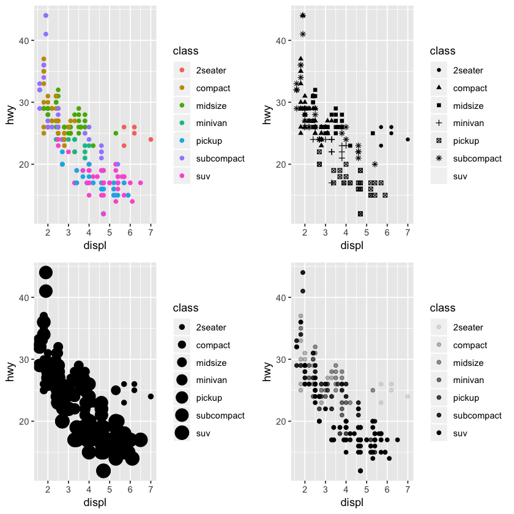

# Preamble

Most of this workshop is taken from Hadley's [R for Data Science](https://r4ds.had.co.nz/) book. You can find more examples, explanations and exercises there if you want.

## What this workshop covers and does not cover

In this workshop you'll learn principles behind exploratory data analysis and visualization, including tidying and transforming data to answer questions you might want to ask. You will also learn ... What you will *not* learn is how to make specific plots such

# Package prerequisites

Packages that required in this workshop are **tidyverse**, which includes the packages **ggplot2**, **dplyr**, **purrr**, and others, **modelr** which provides some helpful functions for visualizing models, **gridExtra** which helps with graph situating, and **ggrepel** which helps with plot labels.


```R
library(tidyverse)
library(modelr)
library(gridExtra)
library(ggrepel)
```

If you get an error message “there is no package called ‘tidyverse’” then you need to install tidyverse first. (This is something you should have done before coming to the workshop, but it's ok if you didn't and it won't take long.)


```R
#install.packages('tidyverse')
#install.packages('modelr')
#install.packages('gridExtra')
#install.packages('ggrepel')
```

# Visualizing Data

Core feature of exploratory data analysis is asking questions about data and searching for answers by visualizing and modeling data.

 * **Variable:** quantity, quality, property that can be measured.
 * **Value:** State of variable when measured.
 * **Observation:** Set of measurements made under similar conditions
 * **Tabular data:** Set of values, each associated with a variable and an observation.
 
Most questions around what type of variation or covariation occurs between variables.

Basic syntax of ggplot:
```{r}
ggplot(data=<DATA>) +
    <GEOM_FUNCTION>(mapping=aes(<MAPPINGS>)
```

## Tidy `<DATA>`

Consider the following table:


```R
table1 <- data.frame(treatmenta=c(NA,16,3),treatmentb=c(2,11,1))
rownames(table1) <- c("John Smith", "Jane Doe", "Mary Johnson")
table1
```


<table>
<thead><tr><th></th><th scope=col>treatmenta</th><th scope=col>treatmentb</th></tr></thead>
<tbody>
	<tr><th scope=row>John Smith</th><td>NA</td><td> 2</td></tr>
	<tr><th scope=row>Jane Doe</th><td>16</td><td>11</td></tr>
	<tr><th scope=row>Mary Johnson</th><td> 3</td><td> 1</td></tr>
</tbody>
</table>


```R
table2 <- data.frame(patient=c("John Smith","John Smith","Jane Doe","John Doe","Mary Johnson","Mary Johnson"),
                     treatment=c("a","b","a","b","a","b"),
                    result=c(NA,2,16,11,3,1))
table2
```


<table>
<thead><tr><th scope=col>patient</th><th scope=col>treatment</th><th scope=col>result</th></tr></thead>
<tbody>
	<tr><td>John Smith  </td><td>a           </td><td>NA          </td></tr>
	<tr><td>John Smith  </td><td>b           </td><td> 2          </td></tr>
	<tr><td>Jane Doe    </td><td>a           </td><td>16          </td></tr>
	<tr><td>John Doe    </td><td>b           </td><td>11          </td></tr>
	<tr><td>Mary Johnson</td><td>a           </td><td> 3          </td></tr>
	<tr><td>Mary Johnson</td><td>b           </td><td> 1          </td></tr>
</tbody>
</table>


Tidy data:
 * Each variable is its own column
 * Each observation is its own row
 * Each value is in a single cell


```R
head(mpg)
```


<table>
<thead><tr><th scope=col>manufacturer</th><th scope=col>model</th><th scope=col>displ</th><th scope=col>year</th><th scope=col>cyl</th><th scope=col>trans</th><th scope=col>drv</th><th scope=col>cty</th><th scope=col>hwy</th><th scope=col>fl</th><th scope=col>class</th></tr></thead>
<tbody>
	<tr><td>audi      </td><td>a4        </td><td>1.8       </td><td>1999      </td><td>4         </td><td>auto(l5)  </td><td>f         </td><td>18        </td><td>29        </td><td>p         </td><td>compact   </td></tr>
	<tr><td>audi      </td><td>a4        </td><td>1.8       </td><td>1999      </td><td>4         </td><td>manual(m5)</td><td>f         </td><td>21        </td><td>29        </td><td>p         </td><td>compact   </td></tr>
	<tr><td>audi      </td><td>a4        </td><td>2.0       </td><td>2008      </td><td>4         </td><td>manual(m6)</td><td>f         </td><td>20        </td><td>31        </td><td>p         </td><td>compact   </td></tr>
	<tr><td>audi      </td><td>a4        </td><td>2.0       </td><td>2008      </td><td>4         </td><td>auto(av)  </td><td>f         </td><td>21        </td><td>30        </td><td>p         </td><td>compact   </td></tr>
	<tr><td>audi      </td><td>a4        </td><td>2.8       </td><td>1999      </td><td>6         </td><td>auto(l5)  </td><td>f         </td><td>16        </td><td>26        </td><td>p         </td><td>compact   </td></tr>
	<tr><td>audi      </td><td>a4        </td><td>2.8       </td><td>1999      </td><td>6         </td><td>manual(m5)</td><td>f         </td><td>18        </td><td>26        </td><td>p         </td><td>compact   </td></tr>
</tbody>
</table>


```R
ggplot(data=mpg) + geom_point(mapping=aes(x=displ,y=hwy))
```


## `<MAPPINGS>`

Visual property of objects in plot, i.e. size, shape, color. Can display points in different ways by changing value of aesthetic properties. These are known as **levels**.


```R
head(mpg)
```


<table>
<thead><tr><th scope=col>manufacturer</th><th scope=col>model</th><th scope=col>displ</th><th scope=col>year</th><th scope=col>cyl</th><th scope=col>trans</th><th scope=col>drv</th><th scope=col>cty</th><th scope=col>hwy</th><th scope=col>fl</th><th scope=col>class</th></tr></thead>
<tbody>
	<tr><td>audi      </td><td>a4        </td><td>1.8       </td><td>1999      </td><td>4         </td><td>auto(l5)  </td><td>f         </td><td>18        </td><td>29        </td><td>p         </td><td>compact   </td></tr>
	<tr><td>audi      </td><td>a4        </td><td>1.8       </td><td>1999      </td><td>4         </td><td>manual(m5)</td><td>f         </td><td>21        </td><td>29        </td><td>p         </td><td>compact   </td></tr>
	<tr><td>audi      </td><td>a4        </td><td>2.0       </td><td>2008      </td><td>4         </td><td>manual(m6)</td><td>f         </td><td>20        </td><td>31        </td><td>p         </td><td>compact   </td></tr>
	<tr><td>audi      </td><td>a4        </td><td>2.0       </td><td>2008      </td><td>4         </td><td>auto(av)  </td><td>f         </td><td>21        </td><td>30        </td><td>p         </td><td>compact   </td></tr>
	<tr><td>audi      </td><td>a4        </td><td>2.8       </td><td>1999      </td><td>6         </td><td>auto(l5)  </td><td>f         </td><td>16        </td><td>26        </td><td>p         </td><td>compact   </td></tr>
	<tr><td>audi      </td><td>a4        </td><td>2.8       </td><td>1999      </td><td>6         </td><td>manual(m5)</td><td>f         </td><td>18        </td><td>26        </td><td>p         </td><td>compact   </td></tr>
</tbody>
</table>


```R
p1 <- ggplot(data=mpg) + geom_point(mapping=aes(x=displ,y=hwy,color=class))
p2 <- ggplot(data=mpg) + geom_point(mapping=aes(x=displ,y=hwy,shape=class))
p3 <- ggplot(data=mpg) + geom_point(mapping=aes(x=displ,y=hwy,size=class))
p4 <- ggplot(data=mpg) + geom_point(mapping=aes(x=displ,y=hwy,alpha=class))
grid.arrange(p1,p2,p3,p4,nrow=2)
```

    Warning message:
    “The shape palette can deal with a maximum of 6 discrete values because
    more than 6 becomes difficult to discriminate; you have 7. Consider
    specifying shapes manually if you must have them.”Warning message:
    “Removed 62 rows containing missing values (geom_point).”Warning message:
    “Using size for a discrete variable is not advised.”Warning message:
    “Using alpha for a discrete variable is not advised.”





Note: **ggplot2** automatically assigns levels and a scale to values. That's why in the size mapping there's no shape for suv, and why the following two pieces of code do different things.


```R
p1 <- ggplot(data=mpg) + geom_point(mapping=aes(x=displ,y=hwy,color='blue'))
p2 <- ggplot(data=mpg) + geom_point(mapping=aes(x=displ,y=hwy),color='blue')
grid.arrange(p1,p2)
```


## `<GEOM_FUNCTION>`

**geom** geometrical object plot uses to represent data. Bar charts use bar geomes, line charts use line geoms, boxplots, etc. Scatterplots use point geoms.

Every geom function in ggplot2 takes a `mapping` argument with specific aesthetic mappings that are possible.


```R
p1 <- ggplot(data = mpg) +
  geom_smooth(mapping = aes(x = displ, y = hwy))
              
p2 <- ggplot(data = mpg) +
  geom_smooth(mapping = aes(x = displ, y = hwy, group = drv))
    
p3 <- ggplot(data = mpg) +
  geom_smooth(
    mapping = aes(x = displ, y = hwy, color = drv),
    show.legend = FALSE
  )

grid.arrange(p1,p2,p3)
```

    `geom_smooth()` using method = 'loess' and formula 'y ~ x'
    `geom_smooth()` using method = 'loess' and formula 'y ~ x'
    `geom_smooth()` using method = 'loess' and formula 'y ~ x'


Can display multiple geoms on same plot just by adding them


```R
ggplot(data = mpg) + 
  geom_point(mapping = aes(x = displ, y = hwy)) +
  geom_smooth(mapping = aes(x = displ, y = hwy))
```

    `geom_smooth()` using method = 'loess' and formula 'y ~ x'


`ggplot()` function contains *global* mapping, while each geom has a local mapping

 * `loess` from **stats** for polynomial regression
 * `lm` from **stats** for linear models (you can also fit other models)


```R
p<-loess(hwy~displ,data=mpg)
grid <- data_grid(data=mpg,displ)
pred1 <- add_predictions(data=grid,p)

p2 <- lm(hwy~displ,data=mpg)
pred2 <- add_predictions(data=grid,p2)

ggplot(data=mpg, mapping=aes(x=displ)) + geom_point(mapping=aes(y=hwy,color=class)) +
    geom_line(aes(y=pred),data=pred1) +
    geom_line(aes(y=pred),data=pred2,color='red')
```


## More syntax

```{r}
ggplot(data = <DATA>) + 
  <GEOM_FUNCTION>(
     mapping = aes(<MAPPINGS>),
     stat = <STAT>, 
     position = <POSITION>
  ) +
  <COORDINATE_FUNCTION> +
  <FACET_FUNCTION>
```

### Facets

Subplots displaying one subset of data.

 * `facet_wrap()` for a single variable.
 * `facet_grid()` for along 2 variables.


```R
ggplot(data=mpg) +
    geom_point(mapping=aes(x=displ,y=hwy)) +
    facet_wrap(~ class, nrow=2)
```


```R
ggplot(data = mpg) + 
  geom_point(mapping = aes(x = displ, y = hwy)) + 
  facet_grid(drv ~ cyl)
```


### Stats

Algorithm used to calculate new values for a graph. Each geom object has a default stat, and each stat has a default geom.


```R
p1 <- ggplot(data=diamonds) +
    geom_bar(mapping=aes(x=cut))

p2 <- ggplot(data=diamonds) + geom_bar(mapping=aes(x=cut,y=..count../sum(..count..)))

p3 <- ggplot(data = mpg) + 
  stat_summary(
    mapping = aes(x = class, y = hwy),
    fun.ymin = min,
    fun.ymax = max,
    fun.y = median
  )

grid.arrange(p1,p2,p3)
```


### Position adjustments


```R
ggplot(data = diamonds) + 
  geom_bar(mapping = aes(x = cut, fill = clarity))
```


```R
ggplot(data = diamonds) + 
  geom_bar(mapping = aes(x = cut, fill = clarity),position="fill")
```


```R
ggplot(data = diamonds) + 
  geom_bar(mapping = aes(x = cut, fill = clarity),position="dodge")
```


### Coordinate systems

 * `coord_flip()` switches x and y axes.
 * `coord_quickmap()` sets aspect ratio for maps.
 * `coord_polar()` sets polar coordinates.


```R
p1 <- ggplot(data = mpg, mapping = aes(x = class, y = hwy)) + 
  geom_boxplot()
p2 <- ggplot(data = mpg, mapping = aes(x = class, y = hwy)) + 
  geom_boxplot() +
  coord_flip()
p3 <- ggplot(data = mpg, mapping = aes(x = reorder(class,hwy,FUN=median), y = hwy)) + 
  geom_boxplot() +
  coord_flip()

grid.arrange(p1,p2,p3)
```


```R
nz <- map_data("nz")

p1 <- ggplot(nz, aes(long, lat, group = group)) +
  geom_polygon(fill = "white", colour = "black")

p2 <- ggplot(nz, aes(long, lat, group = group)) +
  geom_polygon(fill = "white", colour = "black") +
  coord_quickmap()

grid.arrange(p1,p2)
```

    
    Attaching package: ‘maps’
    
    The following object is masked from ‘package:purrr’:
    
        map
    


```R
bar <- ggplot(data = diamonds) + 
  geom_bar(
    mapping = aes(x = cut, fill = cut), 
    show.legend = FALSE,
    width = 1
  ) + 
  theme(aspect.ratio = 1) +
  labs(x = NULL, y = NULL)

p1 <- bar + coord_flip()
p2 <- bar + coord_polar()
grid.arrange(p1,p2, nrow=1)
```


# Transforming (Tidy) Data

 * `filter()` to pick observations (rows) by their values
 * `arrange()` to reorder rows, default is by ascending value
 * `select()` to pick variables (columns) by their names
 * `mutate()` to create new variables with functions of existing variables
 * `summarise()` to collapes many values down to a single summary
 * `group_by()` to set up functions to operate on groups rather than the whole data set
 * `%>%` propagates the output from a function as input to another. eg: x %>% f(y) becomes f(x,y), and x %>% f(y) %>% g(z) becomes g(f(x,y),z).
 
All functions have similar structure:
 1. First argument is data frame
 2. Next arguments describe what to do with data frame using variable names
 3. Result is new data frame


```R
no_2seaters <- filter(mpg, class != "2seater")
head(no_2seaters)
```


<table>
<thead><tr><th scope=col>manufacturer</th><th scope=col>model</th><th scope=col>displ</th><th scope=col>year</th><th scope=col>cyl</th><th scope=col>trans</th><th scope=col>drv</th><th scope=col>cty</th><th scope=col>hwy</th><th scope=col>fl</th><th scope=col>class</th></tr></thead>
<tbody>
	<tr><td>audi      </td><td>a4        </td><td>1.8       </td><td>1999      </td><td>4         </td><td>auto(l5)  </td><td>f         </td><td>18        </td><td>29        </td><td>p         </td><td>compact   </td></tr>
	<tr><td>audi      </td><td>a4        </td><td>1.8       </td><td>1999      </td><td>4         </td><td>manual(m5)</td><td>f         </td><td>21        </td><td>29        </td><td>p         </td><td>compact   </td></tr>
	<tr><td>audi      </td><td>a4        </td><td>2.0       </td><td>2008      </td><td>4         </td><td>manual(m6)</td><td>f         </td><td>20        </td><td>31        </td><td>p         </td><td>compact   </td></tr>
	<tr><td>audi      </td><td>a4        </td><td>2.0       </td><td>2008      </td><td>4         </td><td>auto(av)  </td><td>f         </td><td>21        </td><td>30        </td><td>p         </td><td>compact   </td></tr>
	<tr><td>audi      </td><td>a4        </td><td>2.8       </td><td>1999      </td><td>6         </td><td>auto(l5)  </td><td>f         </td><td>16        </td><td>26        </td><td>p         </td><td>compact   </td></tr>
	<tr><td>audi      </td><td>a4        </td><td>2.8       </td><td>1999      </td><td>6         </td><td>manual(m5)</td><td>f         </td><td>18        </td><td>26        </td><td>p         </td><td>compact   </td></tr>
</tbody>
</table>


```R
head(arrange(mpg, class))
```


<table>
<thead><tr><th scope=col>manufacturer</th><th scope=col>model</th><th scope=col>displ</th><th scope=col>year</th><th scope=col>cyl</th><th scope=col>trans</th><th scope=col>drv</th><th scope=col>cty</th><th scope=col>hwy</th><th scope=col>fl</th><th scope=col>class</th></tr></thead>
<tbody>
	<tr><td>chevrolet </td><td>corvette  </td><td>5.7       </td><td>1999      </td><td>8         </td><td>manual(m6)</td><td>r         </td><td>16        </td><td>26        </td><td>p         </td><td>2seater   </td></tr>
	<tr><td>chevrolet </td><td>corvette  </td><td>5.7       </td><td>1999      </td><td>8         </td><td>auto(l4)  </td><td>r         </td><td>15        </td><td>23        </td><td>p         </td><td>2seater   </td></tr>
	<tr><td>chevrolet </td><td>corvette  </td><td>6.2       </td><td>2008      </td><td>8         </td><td>manual(m6)</td><td>r         </td><td>16        </td><td>26        </td><td>p         </td><td>2seater   </td></tr>
	<tr><td>chevrolet </td><td>corvette  </td><td>6.2       </td><td>2008      </td><td>8         </td><td>auto(s6)  </td><td>r         </td><td>15        </td><td>25        </td><td>p         </td><td>2seater   </td></tr>
	<tr><td>chevrolet </td><td>corvette  </td><td>7.0       </td><td>2008      </td><td>8         </td><td>manual(m6)</td><td>r         </td><td>15        </td><td>24        </td><td>p         </td><td>2seater   </td></tr>
	<tr><td>audi      </td><td>a4        </td><td>1.8       </td><td>1999      </td><td>4         </td><td>auto(l5)  </td><td>f         </td><td>18        </td><td>29        </td><td>p         </td><td>compact   </td></tr>
</tbody>
</table>


```R
head(arrange(no_2seaters, class))
```


<table>
<thead><tr><th scope=col>manufacturer</th><th scope=col>model</th><th scope=col>displ</th><th scope=col>year</th><th scope=col>cyl</th><th scope=col>trans</th><th scope=col>drv</th><th scope=col>cty</th><th scope=col>hwy</th><th scope=col>fl</th><th scope=col>class</th></tr></thead>
<tbody>
	<tr><td>audi      </td><td>a4        </td><td>1.8       </td><td>1999      </td><td>4         </td><td>auto(l5)  </td><td>f         </td><td>18        </td><td>29        </td><td>p         </td><td>compact   </td></tr>
	<tr><td>audi      </td><td>a4        </td><td>1.8       </td><td>1999      </td><td>4         </td><td>manual(m5)</td><td>f         </td><td>21        </td><td>29        </td><td>p         </td><td>compact   </td></tr>
	<tr><td>audi      </td><td>a4        </td><td>2.0       </td><td>2008      </td><td>4         </td><td>manual(m6)</td><td>f         </td><td>20        </td><td>31        </td><td>p         </td><td>compact   </td></tr>
	<tr><td>audi      </td><td>a4        </td><td>2.0       </td><td>2008      </td><td>4         </td><td>auto(av)  </td><td>f         </td><td>21        </td><td>30        </td><td>p         </td><td>compact   </td></tr>
	<tr><td>audi      </td><td>a4        </td><td>2.8       </td><td>1999      </td><td>6         </td><td>auto(l5)  </td><td>f         </td><td>16        </td><td>26        </td><td>p         </td><td>compact   </td></tr>
	<tr><td>audi      </td><td>a4        </td><td>2.8       </td><td>1999      </td><td>6         </td><td>manual(m5)</td><td>f         </td><td>18        </td><td>26        </td><td>p         </td><td>compact   </td></tr>
</tbody>
</table>


What kinds of cars have the best highway and city gas mileage?


```R
head(arrange(mpg, desc(hwy), desc(cty), model))
```


<table>
<thead><tr><th scope=col>manufacturer</th><th scope=col>model</th><th scope=col>displ</th><th scope=col>year</th><th scope=col>cyl</th><th scope=col>trans</th><th scope=col>drv</th><th scope=col>cty</th><th scope=col>hwy</th><th scope=col>fl</th><th scope=col>class</th></tr></thead>
<tbody>
	<tr><td>volkswagen</td><td>new beetle</td><td>1.9       </td><td>1999      </td><td>4         </td><td>manual(m5)</td><td>f         </td><td>35        </td><td>44        </td><td>d         </td><td>subcompact</td></tr>
	<tr><td>volkswagen</td><td>jetta     </td><td>1.9       </td><td>1999      </td><td>4         </td><td>manual(m5)</td><td>f         </td><td>33        </td><td>44        </td><td>d         </td><td>compact   </td></tr>
	<tr><td>volkswagen</td><td>new beetle</td><td>1.9       </td><td>1999      </td><td>4         </td><td>auto(l4)  </td><td>f         </td><td>29        </td><td>41        </td><td>d         </td><td>subcompact</td></tr>
	<tr><td>toyota    </td><td>corolla   </td><td>1.8       </td><td>2008      </td><td>4         </td><td>manual(m5)</td><td>f         </td><td>28        </td><td>37        </td><td>r         </td><td>compact   </td></tr>
	<tr><td>honda     </td><td>civic     </td><td>1.8       </td><td>2008      </td><td>4         </td><td>auto(l5)  </td><td>f         </td><td>25        </td><td>36        </td><td>r         </td><td>subcompact</td></tr>
	<tr><td>honda     </td><td>civic     </td><td>1.8       </td><td>2008      </td><td>4         </td><td>auto(l5)  </td><td>f         </td><td>24        </td><td>36        </td><td>c         </td><td>subcompact</td></tr>
</tbody>
</table>


```R
ar <- arrange(mpg, desc(hwy), desc(cty), model)
head(select(ar, cyl, drv))
```


<table>
<thead><tr><th scope=col>cyl</th><th scope=col>drv</th></tr></thead>
<tbody>
	<tr><td>4</td><td>f</td></tr>
	<tr><td>4</td><td>f</td></tr>
	<tr><td>4</td><td>f</td></tr>
	<tr><td>4</td><td>f</td></tr>
	<tr><td>4</td><td>f</td></tr>
	<tr><td>4</td><td>f</td></tr>
</tbody>
</table>


```R
head(mutate(mpg, avg_mileage = (cty+hwy)/2))
```


<table>
<thead><tr><th scope=col>manufacturer</th><th scope=col>model</th><th scope=col>displ</th><th scope=col>year</th><th scope=col>cyl</th><th scope=col>trans</th><th scope=col>drv</th><th scope=col>cty</th><th scope=col>hwy</th><th scope=col>fl</th><th scope=col>class</th><th scope=col>avg_mileage</th></tr></thead>
<tbody>
	<tr><td>audi      </td><td>a4        </td><td>1.8       </td><td>1999      </td><td>4         </td><td>auto(l5)  </td><td>f         </td><td>18        </td><td>29        </td><td>p         </td><td>compact   </td><td>23.5      </td></tr>
	<tr><td>audi      </td><td>a4        </td><td>1.8       </td><td>1999      </td><td>4         </td><td>manual(m5)</td><td>f         </td><td>21        </td><td>29        </td><td>p         </td><td>compact   </td><td>25.0      </td></tr>
	<tr><td>audi      </td><td>a4        </td><td>2.0       </td><td>2008      </td><td>4         </td><td>manual(m6)</td><td>f         </td><td>20        </td><td>31        </td><td>p         </td><td>compact   </td><td>25.5      </td></tr>
	<tr><td>audi      </td><td>a4        </td><td>2.0       </td><td>2008      </td><td>4         </td><td>auto(av)  </td><td>f         </td><td>21        </td><td>30        </td><td>p         </td><td>compact   </td><td>25.5      </td></tr>
	<tr><td>audi      </td><td>a4        </td><td>2.8       </td><td>1999      </td><td>6         </td><td>auto(l5)  </td><td>f         </td><td>16        </td><td>26        </td><td>p         </td><td>compact   </td><td>21.0      </td></tr>
	<tr><td>audi      </td><td>a4        </td><td>2.8       </td><td>1999      </td><td>6         </td><td>manual(m5)</td><td>f         </td><td>18        </td><td>26        </td><td>p         </td><td>compact   </td><td>22.0      </td></tr>
</tbody>
</table>


```R
head(transmute(mpg,avg_mileage=(cty+hwy)/2))
```


<table>
<thead><tr><th scope=col>avg_mileage</th></tr></thead>
<tbody>
	<tr><td>23.5</td></tr>
	<tr><td>25.0</td></tr>
	<tr><td>25.5</td></tr>
	<tr><td>25.5</td></tr>
	<tr><td>21.0</td></tr>
	<tr><td>22.0</td></tr>
</tbody>
</table>


```R
m <- mutate(mpg, avg_mileage=(cty+hwy)/2)
group_by(m,cyl) %>% summarise(avg=mean(avg_mileage))
```


<table>
<thead><tr><th scope=col>cyl</th><th scope=col>avg</th></tr></thead>
<tbody>
	<tr><td>4       </td><td>24.90741</td></tr>
	<tr><td>5       </td><td>24.62500</td></tr>
	<tr><td>6       </td><td>19.51899</td></tr>
	<tr><td>8       </td><td>15.10000</td></tr>
</tbody>
</table>


```R
group_by(m, drv) %>% summarise(avg=mean(avg_mileage))
```


<table>
<thead><tr><th scope=col>drv</th><th scope=col>avg</th></tr></thead>
<tbody>
	<tr><td>4       </td><td>16.75243</td></tr>
	<tr><td>f       </td><td>24.06604</td></tr>
	<tr><td>r       </td><td>17.54000</td></tr>
</tbody>
</table>


```R
group_by(m, drv, cyl) %>% summarise(avg=mean(avg_mileage)) %>% arrange(desc(avg))
```


<table>
<thead><tr><th scope=col>drv</th><th scope=col>cyl</th><th scope=col>avg</th></tr></thead>
<tbody>
	<tr><td>f       </td><td>4       </td><td>26.26724</td></tr>
	<tr><td>f       </td><td>5       </td><td>24.62500</td></tr>
	<tr><td>4       </td><td>4       </td><td>21.47826</td></tr>
	<tr><td>r       </td><td>6       </td><td>21.25000</td></tr>
	<tr><td>f       </td><td>6       </td><td>21.12791</td></tr>
	<tr><td>f       </td><td>8       </td><td>20.50000</td></tr>
	<tr><td>4       </td><td>6       </td><td>17.14062</td></tr>
	<tr><td>r       </td><td>8       </td><td>16.83333</td></tr>
	<tr><td>4       </td><td>8       </td><td>14.22917</td></tr>
</tbody>
</table>


```R
m %>% count(drv, cyl) %>% ggplot(mapping=aes(y=drv,x=as.factor(cyl))) + geom_tile(mapping=aes(fill=n))
```


```R
ggplot(data = mpg, mapping = aes(x = displ, y = hwy)) + 
  geom_point(mapping = aes(color = class)) + 
  geom_smooth(data = no_2seaters, se = FALSE)
```

    `geom_smooth()` using method = 'loess' and formula 'y ~ x'


# Importing Data

## readr

The package **readr** provides options for importing data that has already been set up as tables, such as csvs:
 * `read_csv()` is for comma-delimited files
 * `read_csv2()` is for semicolon-delimited files
 * `read_tsv()` is for tab-delimited files
 * `read_delim()` is for any other delimiters
 * `read_fwf()` is for fixed width files
 * `read_table()` is for fixed width files with columns separated by white space

If you are used to using `read.csv`, `read.table` or other functions from **utils**, these are almost exactly the same except that they import data as tibbles (special kind of data frame designed for dplyr that contains column type info, dimensions and prints out only beginning of df instead of all) instead of data frames. They are also about 10x faster, provide progress bars when loading larger files, and provide typing for columns.

If your file is massive and you *really* need something as fast as possible, look into the **data.table** package (or consider writing your core functions in C++ and using the **Rcpp** package). Data tables don't fit exactly into the tidyverse but it is not too much more of a learning curve.


```R
mtcars <- read_csv(readr_example("mtcars.csv"))
```

    Parsed with column specification:
    cols(
      mpg = col_double(),
      cyl = col_double(),
      disp = col_double(),
      hp = col_double(),
      drat = col_double(),
      wt = col_double(),
      qsec = col_double(),
      vs = col_double(),
      am = col_double(),
      gear = col_double(),
      carb = col_double()
    )


These functions have other optional arguments that can be helpful as well.

 * `delim`: in `read_delim()` denotes what delimiter to use
 * `col_types`: if you know what column types you want your tibble to have, specify it here. Can be useful because often data gets parsed as `factor` or `character` when you may want it to be `character` or `numeric`.
 * `skip`: how many lines to skip. Default is 0. Useful for when the file you're reading in has comments at the beginning, such as in SAM files.

We won't go through the other arguments, but you can view them in the help for the functions.


```R
?read_csv
```


```R
challenge <- read_csv(readr_example("challenge.csv"))
problems(challenge)
```

    Parsed with column specification:
    cols(
      x = col_double(),
      y = col_logical()
    )
    Warning message:
    “1000 parsing failures.
     row col           expected     actual                                                                                         file
    1001   y 1/0/T/F/TRUE/FALSE 2015-01-16 '/Library/Frameworks/R.framework/Versions/3.5/Resources/library/readr/extdata/challenge.csv'
    1002   y 1/0/T/F/TRUE/FALSE 2018-05-18 '/Library/Frameworks/R.framework/Versions/3.5/Resources/library/readr/extdata/challenge.csv'
    1003   y 1/0/T/F/TRUE/FALSE 2015-09-05 '/Library/Frameworks/R.framework/Versions/3.5/Resources/library/readr/extdata/challenge.csv'
    1004   y 1/0/T/F/TRUE/FALSE 2012-11-28 '/Library/Frameworks/R.framework/Versions/3.5/Resources/library/readr/extdata/challenge.csv'
    1005   y 1/0/T/F/TRUE/FALSE 2020-01-13 '/Library/Frameworks/R.framework/Versions/3.5/Resources/library/readr/extdata/challenge.csv'
    .... ... .................. .......... ............................................................................................
    See problems(...) for more details.
    ”


<table>
<thead><tr><th scope=col>row</th><th scope=col>col</th><th scope=col>expected</th><th scope=col>actual</th><th scope=col>file</th></tr></thead>
<tbody>
	<tr><td>1001                                                                                        </td><td>y                                                                                           </td><td>1/0/T/F/TRUE/FALSE                                                                          </td><td>2015-01-16                                                                                  </td><td>'/Library/Frameworks/R.framework/Versions/3.5/Resources/library/readr/extdata/challenge.csv'</td></tr>
	<tr><td>1002                                                                                        </td><td>y                                                                                           </td><td>1/0/T/F/TRUE/FALSE                                                                          </td><td>2018-05-18                                                                                  </td><td>'/Library/Frameworks/R.framework/Versions/3.5/Resources/library/readr/extdata/challenge.csv'</td></tr>
	<tr><td>1003                                                                                        </td><td>y                                                                                           </td><td>1/0/T/F/TRUE/FALSE                                                                          </td><td>2015-09-05                                                                                  </td><td>'/Library/Frameworks/R.framework/Versions/3.5/Resources/library/readr/extdata/challenge.csv'</td></tr>
	<tr><td>1004                                                                                        </td><td>y                                                                                           </td><td>1/0/T/F/TRUE/FALSE                                                                          </td><td>2012-11-28                                                                                  </td><td>'/Library/Frameworks/R.framework/Versions/3.5/Resources/library/readr/extdata/challenge.csv'</td></tr>
	<tr><td>1005                                                                                        </td><td>y                                                                                           </td><td>1/0/T/F/TRUE/FALSE                                                                          </td><td>2020-01-13                                                                                  </td><td>'/Library/Frameworks/R.framework/Versions/3.5/Resources/library/readr/extdata/challenge.csv'</td></tr>
	<tr><td>1006                                                                                        </td><td>y                                                                                           </td><td>1/0/T/F/TRUE/FALSE                                                                          </td><td>2016-04-17                                                                                  </td><td>'/Library/Frameworks/R.framework/Versions/3.5/Resources/library/readr/extdata/challenge.csv'</td></tr>
	<tr><td>1007                                                                                        </td><td>y                                                                                           </td><td>1/0/T/F/TRUE/FALSE                                                                          </td><td>2011-05-14                                                                                  </td><td>'/Library/Frameworks/R.framework/Versions/3.5/Resources/library/readr/extdata/challenge.csv'</td></tr>
	<tr><td>1008                                                                                        </td><td>y                                                                                           </td><td>1/0/T/F/TRUE/FALSE                                                                          </td><td>2020-07-18                                                                                  </td><td>'/Library/Frameworks/R.framework/Versions/3.5/Resources/library/readr/extdata/challenge.csv'</td></tr>
	<tr><td>1009                                                                                        </td><td>y                                                                                           </td><td>1/0/T/F/TRUE/FALSE                                                                          </td><td>2011-04-30                                                                                  </td><td>'/Library/Frameworks/R.framework/Versions/3.5/Resources/library/readr/extdata/challenge.csv'</td></tr>
	<tr><td>1010                                                                                        </td><td>y                                                                                           </td><td>1/0/T/F/TRUE/FALSE                                                                          </td><td>2010-05-11                                                                                  </td><td>'/Library/Frameworks/R.framework/Versions/3.5/Resources/library/readr/extdata/challenge.csv'</td></tr>
	<tr><td>1011                                                                                        </td><td>y                                                                                           </td><td>1/0/T/F/TRUE/FALSE                                                                          </td><td>2014-11-02                                                                                  </td><td>'/Library/Frameworks/R.framework/Versions/3.5/Resources/library/readr/extdata/challenge.csv'</td></tr>
	<tr><td>1012                                                                                        </td><td>y                                                                                           </td><td>1/0/T/F/TRUE/FALSE                                                                          </td><td>2014-06-23                                                                                  </td><td>'/Library/Frameworks/R.framework/Versions/3.5/Resources/library/readr/extdata/challenge.csv'</td></tr>
	<tr><td>1013                                                                                        </td><td>y                                                                                           </td><td>1/0/T/F/TRUE/FALSE                                                                          </td><td>2017-05-31                                                                                  </td><td>'/Library/Frameworks/R.framework/Versions/3.5/Resources/library/readr/extdata/challenge.csv'</td></tr>
	<tr><td>1014                                                                                        </td><td>y                                                                                           </td><td>1/0/T/F/TRUE/FALSE                                                                          </td><td>2017-11-18                                                                                  </td><td>'/Library/Frameworks/R.framework/Versions/3.5/Resources/library/readr/extdata/challenge.csv'</td></tr>
	<tr><td>1015                                                                                        </td><td>y                                                                                           </td><td>1/0/T/F/TRUE/FALSE                                                                          </td><td>2013-04-20                                                                                  </td><td>'/Library/Frameworks/R.framework/Versions/3.5/Resources/library/readr/extdata/challenge.csv'</td></tr>
	<tr><td>1016                                                                                        </td><td>y                                                                                           </td><td>1/0/T/F/TRUE/FALSE                                                                          </td><td>2010-12-11                                                                                  </td><td>'/Library/Frameworks/R.framework/Versions/3.5/Resources/library/readr/extdata/challenge.csv'</td></tr>
	<tr><td>1017                                                                                        </td><td>y                                                                                           </td><td>1/0/T/F/TRUE/FALSE                                                                          </td><td>2022-10-10                                                                                  </td><td>'/Library/Frameworks/R.framework/Versions/3.5/Resources/library/readr/extdata/challenge.csv'</td></tr>
	<tr><td>1018                                                                                        </td><td>y                                                                                           </td><td>1/0/T/F/TRUE/FALSE                                                                          </td><td>2010-11-11                                                                                  </td><td>'/Library/Frameworks/R.framework/Versions/3.5/Resources/library/readr/extdata/challenge.csv'</td></tr>
	<tr><td>1019                                                                                        </td><td>y                                                                                           </td><td>1/0/T/F/TRUE/FALSE                                                                          </td><td>2015-03-22                                                                                  </td><td>'/Library/Frameworks/R.framework/Versions/3.5/Resources/library/readr/extdata/challenge.csv'</td></tr>
	<tr><td>1020                                                                                        </td><td>y                                                                                           </td><td>1/0/T/F/TRUE/FALSE                                                                          </td><td>2013-12-25                                                                                  </td><td>'/Library/Frameworks/R.framework/Versions/3.5/Resources/library/readr/extdata/challenge.csv'</td></tr>
	<tr><td>1021                                                                                        </td><td>y                                                                                           </td><td>1/0/T/F/TRUE/FALSE                                                                          </td><td>2011-02-27                                                                                  </td><td>'/Library/Frameworks/R.framework/Versions/3.5/Resources/library/readr/extdata/challenge.csv'</td></tr>
	<tr><td>1022                                                                                        </td><td>y                                                                                           </td><td>1/0/T/F/TRUE/FALSE                                                                          </td><td>2015-12-14                                                                                  </td><td>'/Library/Frameworks/R.framework/Versions/3.5/Resources/library/readr/extdata/challenge.csv'</td></tr>
	<tr><td>1023                                                                                        </td><td>y                                                                                           </td><td>1/0/T/F/TRUE/FALSE                                                                          </td><td>2021-02-10                                                                                  </td><td>'/Library/Frameworks/R.framework/Versions/3.5/Resources/library/readr/extdata/challenge.csv'</td></tr>
	<tr><td>1024                                                                                        </td><td>y                                                                                           </td><td>1/0/T/F/TRUE/FALSE                                                                          </td><td>2012-11-28                                                                                  </td><td>'/Library/Frameworks/R.framework/Versions/3.5/Resources/library/readr/extdata/challenge.csv'</td></tr>
	<tr><td>1025                                                                                        </td><td>y                                                                                           </td><td>1/0/T/F/TRUE/FALSE                                                                          </td><td>2020-04-04                                                                                  </td><td>'/Library/Frameworks/R.framework/Versions/3.5/Resources/library/readr/extdata/challenge.csv'</td></tr>
	<tr><td>1026                                                                                        </td><td>y                                                                                           </td><td>1/0/T/F/TRUE/FALSE                                                                          </td><td>2021-04-08                                                                                  </td><td>'/Library/Frameworks/R.framework/Versions/3.5/Resources/library/readr/extdata/challenge.csv'</td></tr>
	<tr><td>1027                                                                                        </td><td>y                                                                                           </td><td>1/0/T/F/TRUE/FALSE                                                                          </td><td>2022-03-13                                                                                  </td><td>'/Library/Frameworks/R.framework/Versions/3.5/Resources/library/readr/extdata/challenge.csv'</td></tr>
	<tr><td>1028                                                                                        </td><td>y                                                                                           </td><td>1/0/T/F/TRUE/FALSE                                                                          </td><td>2010-03-28                                                                                  </td><td>'/Library/Frameworks/R.framework/Versions/3.5/Resources/library/readr/extdata/challenge.csv'</td></tr>
	<tr><td>1029                                                                                        </td><td>y                                                                                           </td><td>1/0/T/F/TRUE/FALSE                                                                          </td><td>2023-01-04                                                                                  </td><td>'/Library/Frameworks/R.framework/Versions/3.5/Resources/library/readr/extdata/challenge.csv'</td></tr>
	<tr><td>1030                                                                                        </td><td>y                                                                                           </td><td>1/0/T/F/TRUE/FALSE                                                                          </td><td>2012-04-02                                                                                  </td><td>'/Library/Frameworks/R.framework/Versions/3.5/Resources/library/readr/extdata/challenge.csv'</td></tr>
	<tr><td>⋮</td><td>⋮</td><td>⋮</td><td>⋮</td><td>⋮</td></tr>
	<tr><td>1971                                                                                        </td><td>y                                                                                           </td><td>1/0/T/F/TRUE/FALSE                                                                          </td><td>2020-06-10                                                                                  </td><td>'/Library/Frameworks/R.framework/Versions/3.5/Resources/library/readr/extdata/challenge.csv'</td></tr>
	<tr><td>1972                                                                                        </td><td>y                                                                                           </td><td>1/0/T/F/TRUE/FALSE                                                                          </td><td>2013-11-08                                                                                  </td><td>'/Library/Frameworks/R.framework/Versions/3.5/Resources/library/readr/extdata/challenge.csv'</td></tr>
	<tr><td>1973                                                                                        </td><td>y                                                                                           </td><td>1/0/T/F/TRUE/FALSE                                                                          </td><td>2017-07-12                                                                                  </td><td>'/Library/Frameworks/R.framework/Versions/3.5/Resources/library/readr/extdata/challenge.csv'</td></tr>
	<tr><td>1974                                                                                        </td><td>y                                                                                           </td><td>1/0/T/F/TRUE/FALSE                                                                          </td><td>2016-08-12                                                                                  </td><td>'/Library/Frameworks/R.framework/Versions/3.5/Resources/library/readr/extdata/challenge.csv'</td></tr>
	<tr><td>1975                                                                                        </td><td>y                                                                                           </td><td>1/0/T/F/TRUE/FALSE                                                                          </td><td>2022-05-12                                                                                  </td><td>'/Library/Frameworks/R.framework/Versions/3.5/Resources/library/readr/extdata/challenge.csv'</td></tr>
	<tr><td>1976                                                                                        </td><td>y                                                                                           </td><td>1/0/T/F/TRUE/FALSE                                                                          </td><td>2020-08-11                                                                                  </td><td>'/Library/Frameworks/R.framework/Versions/3.5/Resources/library/readr/extdata/challenge.csv'</td></tr>
	<tr><td>1977                                                                                        </td><td>y                                                                                           </td><td>1/0/T/F/TRUE/FALSE                                                                          </td><td>2011-10-26                                                                                  </td><td>'/Library/Frameworks/R.framework/Versions/3.5/Resources/library/readr/extdata/challenge.csv'</td></tr>
	<tr><td>1978                                                                                        </td><td>y                                                                                           </td><td>1/0/T/F/TRUE/FALSE                                                                          </td><td>2015-12-09                                                                                  </td><td>'/Library/Frameworks/R.framework/Versions/3.5/Resources/library/readr/extdata/challenge.csv'</td></tr>
	<tr><td>1979                                                                                        </td><td>y                                                                                           </td><td>1/0/T/F/TRUE/FALSE                                                                          </td><td>2012-09-27                                                                                  </td><td>'/Library/Frameworks/R.framework/Versions/3.5/Resources/library/readr/extdata/challenge.csv'</td></tr>
	<tr><td>1980                                                                                        </td><td>y                                                                                           </td><td>1/0/T/F/TRUE/FALSE                                                                          </td><td>2013-02-04                                                                                  </td><td>'/Library/Frameworks/R.framework/Versions/3.5/Resources/library/readr/extdata/challenge.csv'</td></tr>
	<tr><td>1981                                                                                        </td><td>y                                                                                           </td><td>1/0/T/F/TRUE/FALSE                                                                          </td><td>2010-11-29                                                                                  </td><td>'/Library/Frameworks/R.framework/Versions/3.5/Resources/library/readr/extdata/challenge.csv'</td></tr>
	<tr><td>1982                                                                                        </td><td>y                                                                                           </td><td>1/0/T/F/TRUE/FALSE                                                                          </td><td>2013-10-16                                                                                  </td><td>'/Library/Frameworks/R.framework/Versions/3.5/Resources/library/readr/extdata/challenge.csv'</td></tr>
	<tr><td>1983                                                                                        </td><td>y                                                                                           </td><td>1/0/T/F/TRUE/FALSE                                                                          </td><td>2015-04-26                                                                                  </td><td>'/Library/Frameworks/R.framework/Versions/3.5/Resources/library/readr/extdata/challenge.csv'</td></tr>
	<tr><td>1984                                                                                        </td><td>y                                                                                           </td><td>1/0/T/F/TRUE/FALSE                                                                          </td><td>2011-04-12                                                                                  </td><td>'/Library/Frameworks/R.framework/Versions/3.5/Resources/library/readr/extdata/challenge.csv'</td></tr>
	<tr><td>1985                                                                                        </td><td>y                                                                                           </td><td>1/0/T/F/TRUE/FALSE                                                                          </td><td>2017-01-30                                                                                  </td><td>'/Library/Frameworks/R.framework/Versions/3.5/Resources/library/readr/extdata/challenge.csv'</td></tr>
	<tr><td>1986                                                                                        </td><td>y                                                                                           </td><td>1/0/T/F/TRUE/FALSE                                                                          </td><td>2014-06-08                                                                                  </td><td>'/Library/Frameworks/R.framework/Versions/3.5/Resources/library/readr/extdata/challenge.csv'</td></tr>
	<tr><td>1987                                                                                        </td><td>y                                                                                           </td><td>1/0/T/F/TRUE/FALSE                                                                          </td><td>2016-10-19                                                                                  </td><td>'/Library/Frameworks/R.framework/Versions/3.5/Resources/library/readr/extdata/challenge.csv'</td></tr>
	<tr><td>1988                                                                                        </td><td>y                                                                                           </td><td>1/0/T/F/TRUE/FALSE                                                                          </td><td>2023-09-01                                                                                  </td><td>'/Library/Frameworks/R.framework/Versions/3.5/Resources/library/readr/extdata/challenge.csv'</td></tr>
	<tr><td>1989                                                                                        </td><td>y                                                                                           </td><td>1/0/T/F/TRUE/FALSE                                                                          </td><td>2010-01-09                                                                                  </td><td>'/Library/Frameworks/R.framework/Versions/3.5/Resources/library/readr/extdata/challenge.csv'</td></tr>
	<tr><td>1990                                                                                        </td><td>y                                                                                           </td><td>1/0/T/F/TRUE/FALSE                                                                          </td><td>2020-01-11                                                                                  </td><td>'/Library/Frameworks/R.framework/Versions/3.5/Resources/library/readr/extdata/challenge.csv'</td></tr>
	<tr><td>1991                                                                                        </td><td>y                                                                                           </td><td>1/0/T/F/TRUE/FALSE                                                                          </td><td>2016-12-16                                                                                  </td><td>'/Library/Frameworks/R.framework/Versions/3.5/Resources/library/readr/extdata/challenge.csv'</td></tr>
	<tr><td>1992                                                                                        </td><td>y                                                                                           </td><td>1/0/T/F/TRUE/FALSE                                                                          </td><td>2010-01-03                                                                                  </td><td>'/Library/Frameworks/R.framework/Versions/3.5/Resources/library/readr/extdata/challenge.csv'</td></tr>
	<tr><td>1993                                                                                        </td><td>y                                                                                           </td><td>1/0/T/F/TRUE/FALSE                                                                          </td><td>2016-04-23                                                                                  </td><td>'/Library/Frameworks/R.framework/Versions/3.5/Resources/library/readr/extdata/challenge.csv'</td></tr>
	<tr><td>1994                                                                                        </td><td>y                                                                                           </td><td>1/0/T/F/TRUE/FALSE                                                                          </td><td>2016-08-10                                                                                  </td><td>'/Library/Frameworks/R.framework/Versions/3.5/Resources/library/readr/extdata/challenge.csv'</td></tr>
	<tr><td>1995                                                                                        </td><td>y                                                                                           </td><td>1/0/T/F/TRUE/FALSE                                                                          </td><td>2019-11-21                                                                                  </td><td>'/Library/Frameworks/R.framework/Versions/3.5/Resources/library/readr/extdata/challenge.csv'</td></tr>
	<tr><td>1996                                                                                        </td><td>y                                                                                           </td><td>1/0/T/F/TRUE/FALSE                                                                          </td><td>2018-03-29                                                                                  </td><td>'/Library/Frameworks/R.framework/Versions/3.5/Resources/library/readr/extdata/challenge.csv'</td></tr>
	<tr><td>1997                                                                                        </td><td>y                                                                                           </td><td>1/0/T/F/TRUE/FALSE                                                                          </td><td>2014-08-04                                                                                  </td><td>'/Library/Frameworks/R.framework/Versions/3.5/Resources/library/readr/extdata/challenge.csv'</td></tr>
	<tr><td>1998                                                                                        </td><td>y                                                                                           </td><td>1/0/T/F/TRUE/FALSE                                                                          </td><td>2015-08-16                                                                                  </td><td>'/Library/Frameworks/R.framework/Versions/3.5/Resources/library/readr/extdata/challenge.csv'</td></tr>
	<tr><td>1999                                                                                        </td><td>y                                                                                           </td><td>1/0/T/F/TRUE/FALSE                                                                          </td><td>2020-02-04                                                                                  </td><td>'/Library/Frameworks/R.framework/Versions/3.5/Resources/library/readr/extdata/challenge.csv'</td></tr>
	<tr><td>2000                                                                                        </td><td>y                                                                                           </td><td>1/0/T/F/TRUE/FALSE                                                                          </td><td>2019-01-06                                                                                  </td><td>'/Library/Frameworks/R.framework/Versions/3.5/Resources/library/readr/extdata/challenge.csv'</td></tr>
</tbody>
</table>


# Tidying Data

Tidy data:
 * Each variable is its own column
 * Each observation is its own row
 * Each value is in a single cell

Consider the following tables:


```R
table1 <- data.frame(country=c("Afghanistan","Afghanistan","Brazil","Brazil","China","China"),
                     year=rep(c(1999,2000),3),
                    cases=c(745,2666,37737,80488,212258,213766),
                    population=c(19987071,20595360,172006362,174504898,1272915272,1280428583))
table1
```


<table>
<thead><tr><th scope=col>country</th><th scope=col>year</th><th scope=col>cases</th><th scope=col>population</th></tr></thead>
<tbody>
	<tr><td>Afghanistan</td><td>1999       </td><td>   745     </td><td>  19987071 </td></tr>
	<tr><td>Afghanistan</td><td>2000       </td><td>  2666     </td><td>  20595360 </td></tr>
	<tr><td>Brazil     </td><td>1999       </td><td> 37737     </td><td> 172006362 </td></tr>
	<tr><td>Brazil     </td><td>2000       </td><td> 80488     </td><td> 174504898 </td></tr>
	<tr><td>China      </td><td>1999       </td><td>212258     </td><td>1272915272 </td></tr>
	<tr><td>China      </td><td>2000       </td><td>213766     </td><td>1280428583 </td></tr>
</tbody>
</table>


```R
table2 <- data.frame(country=c(rep("Afghanistan",4),rep("Brazil",4),rep("China",4)),
                    year=rep(c(1999,1999,2000,2000),3),
                    type=rep(c("cases","population"),6),
                     count=c(745,19987071,2666,20595360,37737,172006362,80488,174504898,212258,1272915272,213766,1280428583))
head(table2)
```


<table>
<thead><tr><th scope=col>country</th><th scope=col>year</th><th scope=col>type</th><th scope=col>count</th></tr></thead>
<tbody>
	<tr><td>Afghanistan</td><td>1999       </td><td>cases      </td><td>      745  </td></tr>
	<tr><td>Afghanistan</td><td>1999       </td><td>population </td><td> 19987071  </td></tr>
	<tr><td>Afghanistan</td><td>2000       </td><td>cases      </td><td>     2666  </td></tr>
	<tr><td>Afghanistan</td><td>2000       </td><td>population </td><td> 20595360  </td></tr>
	<tr><td>Brazil     </td><td>1999       </td><td>cases      </td><td>    37737  </td></tr>
	<tr><td>Brazil     </td><td>1999       </td><td>population </td><td>172006362  </td></tr>
</tbody>
</table>


```R
table3 <- data.frame(country=c("Afghanistan","Afghanistan","Brazil","Brazil","China","China"),
                     year=rep(c(1999,2000),3),
                    rate=(c('745/19987071','2666/20595360','37737/172006362','80488/174504898','212258/1272915272','213766/1280428583')))
head(table3)
```


<table>
<thead><tr><th scope=col>country</th><th scope=col>year</th><th scope=col>rate</th></tr></thead>
<tbody>
	<tr><td>Afghanistan      </td><td>1999             </td><td>745/19987071     </td></tr>
	<tr><td>Afghanistan      </td><td>2000             </td><td>2666/20595360    </td></tr>
	<tr><td>Brazil           </td><td>1999             </td><td>37737/172006362  </td></tr>
	<tr><td>Brazil           </td><td>2000             </td><td>80488/174504898  </td></tr>
	<tr><td>China            </td><td>1999             </td><td>212258/1272915272</td></tr>
	<tr><td>China            </td><td>2000             </td><td>213766/1280428583</td></tr>
</tbody>
</table>


```R
table4a <- data.frame(country=c("Afghanistan","Brazil","China"),`1999`=c(745,37737,212258),'2000'=c(2666,80488,213766),check.names=FALSE)
table4b <- data.frame(country=c("Afghanistan","Brazil","China"),`1999`=c(19987071,172006362,1272915272),'2000'=c(20595360,174504898,1280428583),check.names=FALSE)
table4a
table4b
```


<table>
<thead><tr><th scope=col>country</th><th scope=col>1999</th><th scope=col>2000</th></tr></thead>
<tbody>
	<tr><td>Afghanistan</td><td>   745     </td><td>  2666     </td></tr>
	<tr><td>Brazil     </td><td> 37737     </td><td> 80488     </td></tr>
	<tr><td>China      </td><td>212258     </td><td>213766     </td></tr>
</tbody>
</table>


<table>
<thead><tr><th scope=col>country</th><th scope=col>1999</th><th scope=col>2000</th></tr></thead>
<tbody>
	<tr><td>Afghanistan</td><td>  19987071 </td><td>  20595360 </td></tr>
	<tr><td>Brazil     </td><td> 172006362 </td><td> 174504898 </td></tr>
	<tr><td>China      </td><td>1272915272 </td><td>1280428583 </td></tr>
</tbody>
</table>


## Gathering

`table4a` column names `1999` and `2000` represent values of `year` variable. Each row represents 2 observations, not 1. Need to gather columns into new pair of variables.

Parameters:
 * Set of columns that represent values, not variables.
 * `key`: name of variable whose values are currently column names.
 * `value`: name of variable whose values are currently spread out across multiple columns.


```R
tidy4a <- table4a %>% gather(`1999`,`2000`,key="year",value="cases")
tidy4a
```


<table>
<thead><tr><th scope=col>country</th><th scope=col>year</th><th scope=col>cases</th></tr></thead>
<tbody>
	<tr><td>Afghanistan</td><td>1999       </td><td>   745     </td></tr>
	<tr><td>Brazil     </td><td>1999       </td><td> 37737     </td></tr>
	<tr><td>China      </td><td>1999       </td><td>212258     </td></tr>
	<tr><td>Afghanistan</td><td>2000       </td><td>  2666     </td></tr>
	<tr><td>Brazil     </td><td>2000       </td><td> 80488     </td></tr>
	<tr><td>China      </td><td>2000       </td><td>213766     </td></tr>
</tbody>
</table>


```R
tidy4b <- table4b %>% 
  gather(`1999`, `2000`, key = "year", value = "population")
tidy4b
```


<table>
<thead><tr><th scope=col>country</th><th scope=col>year</th><th scope=col>population</th></tr></thead>
<tbody>
	<tr><td>Afghanistan</td><td>1999       </td><td>  19987071 </td></tr>
	<tr><td>Brazil     </td><td>1999       </td><td> 172006362 </td></tr>
	<tr><td>China      </td><td>1999       </td><td>1272915272 </td></tr>
	<tr><td>Afghanistan</td><td>2000       </td><td>  20595360 </td></tr>
	<tr><td>Brazil     </td><td>2000       </td><td> 174504898 </td></tr>
	<tr><td>China      </td><td>2000       </td><td>1280428583 </td></tr>
</tbody>
</table>


Merge tables using `left_join()` (many other types of table joins as well)


```R
left_join(tidy4a,tidy4b)
```

    Joining, by = c("country", "year")


<table>
<thead><tr><th scope=col>country</th><th scope=col>year</th><th scope=col>cases</th><th scope=col>population</th></tr></thead>
<tbody>
	<tr><td>Afghanistan</td><td>1999       </td><td>   745     </td><td>  19987071 </td></tr>
	<tr><td>Brazil     </td><td>1999       </td><td> 37737     </td><td> 172006362 </td></tr>
	<tr><td>China      </td><td>1999       </td><td>212258     </td><td>1272915272 </td></tr>
	<tr><td>Afghanistan</td><td>2000       </td><td>  2666     </td><td>  20595360 </td></tr>
	<tr><td>Brazil     </td><td>2000       </td><td> 80488     </td><td> 174504898 </td></tr>
	<tr><td>China      </td><td>2000       </td><td>213766     </td><td>1280428583 </td></tr>
</tbody>
</table>


## Spreading

`table2` has each observation in two rows. Need to spread observations across columns with appropriate variable names instead.

Parameters:
 * `key`: Column that contains variable names.
 * `value`: Column that contains values for each variable.


```R
table2 %>% spread(key=type,value=count)
```


<table>
<thead><tr><th scope=col>country</th><th scope=col>year</th><th scope=col>cases</th><th scope=col>population</th></tr></thead>
<tbody>
	<tr><td>Afghanistan</td><td>1999       </td><td>   745     </td><td>  19987071 </td></tr>
	<tr><td>Afghanistan</td><td>2000       </td><td>  2666     </td><td>  20595360 </td></tr>
	<tr><td>Brazil     </td><td>1999       </td><td> 37737     </td><td> 172006362 </td></tr>
	<tr><td>Brazil     </td><td>2000       </td><td> 80488     </td><td> 174504898 </td></tr>
	<tr><td>China      </td><td>1999       </td><td>212258     </td><td>1272915272 </td></tr>
	<tr><td>China      </td><td>2000       </td><td>213766     </td><td>1280428583 </td></tr>
</tbody>
</table>


## Separating

`table3` has `rate` column that actually contains two variables (`cases` and `population`). Need to separate into two columns.

Parameters:
 * column/variable that needs to be separated.
 * `into`: columns to split into
 * `sep`: separator value. Can be regexp or positions to split at. If not provided then splits at non-alphanumeric characters.


```R
table3 %>% 
  separate(rate, into = c("cases", "population"), sep="/")
```


<table>
<thead><tr><th scope=col>country</th><th scope=col>year</th><th scope=col>cases</th><th scope=col>population</th></tr></thead>
<tbody>
	<tr><td>Afghanistan</td><td>1999       </td><td>745        </td><td>19987071   </td></tr>
	<tr><td>Afghanistan</td><td>2000       </td><td>2666       </td><td>20595360   </td></tr>
	<tr><td>Brazil     </td><td>1999       </td><td>37737      </td><td>172006362  </td></tr>
	<tr><td>Brazil     </td><td>2000       </td><td>80488      </td><td>174504898  </td></tr>
	<tr><td>China      </td><td>1999       </td><td>212258     </td><td>1272915272 </td></tr>
	<tr><td>China      </td><td>2000       </td><td>213766     </td><td>1280428583 </td></tr>
</tbody>
</table>


```R
sep <- table3 %>% 
  separate(year, into = c("century", "year"), sep = 2)
sep
```


<table>
<thead><tr><th scope=col>country</th><th scope=col>century</th><th scope=col>year</th><th scope=col>rate</th></tr></thead>
<tbody>
	<tr><td>Afghanistan      </td><td>19               </td><td>99               </td><td>745/19987071     </td></tr>
	<tr><td>Afghanistan      </td><td>20               </td><td>00               </td><td>2666/20595360    </td></tr>
	<tr><td>Brazil           </td><td>19               </td><td>99               </td><td>37737/172006362  </td></tr>
	<tr><td>Brazil           </td><td>20               </td><td>00               </td><td>80488/174504898  </td></tr>
	<tr><td>China            </td><td>19               </td><td>99               </td><td>212258/1272915272</td></tr>
	<tr><td>China            </td><td>20               </td><td>00               </td><td>213766/1280428583</td></tr>
</tbody>
</table>


## Uniting

Now `sep` has `century` and `year` columns that can be combined into a single column. In other words, we want to unite them.

Parameters:
 * Name of united column/variable
 * Names of columns/variables to be united
 * `sep`: Separator value. Defualt is '_'


```R
sep %>% 
  unite(new, century, year)
```


<table>
<thead><tr><th scope=col>country</th><th scope=col>new</th><th scope=col>rate</th></tr></thead>
<tbody>
	<tr><td>Afghanistan      </td><td>19_99            </td><td>745/19987071     </td></tr>
	<tr><td>Afghanistan      </td><td>20_00            </td><td>2666/20595360    </td></tr>
	<tr><td>Brazil           </td><td>19_99            </td><td>37737/172006362  </td></tr>
	<tr><td>Brazil           </td><td>20_00            </td><td>80488/174504898  </td></tr>
	<tr><td>China            </td><td>19_99            </td><td>212258/1272915272</td></tr>
	<tr><td>China            </td><td>20_00            </td><td>213766/1280428583</td></tr>
</tbody>
</table>


## Not all data should be tidy

Matrices, phylogenetic trees (although `ggtree` and `treeio` have tidy representations that help with annotating trees), etc.

# Publication Quality Graphs

## Labels

`labs()` to add most kinds of labels: title, subtitle, captions, x-axis, y-axis, legend, etc.


```R
ggplot(mpg, aes(displ, hwy)) +
  geom_point(aes(color = class)) +
  geom_smooth(se = FALSE) +
  labs(
    title = "Fuel efficiency generally decreases with engine size",
    subtitle = "Two seaters (sports cars) are an exception because of their light weight",
    caption = "Data from fueleconomy.gov",
    x = "Engine displacement (L)",
    y = "Highway fuel economy (mpg)",
    colour = "Car type"
  )
```

    `geom_smooth()` using method = 'loess' and formula 'y ~ x'


## Annotations

Can use `geom_text()` to add text labesls on the plot.


```R
best_in_class <- mpg %>%
  group_by(class) %>%
  filter(row_number(desc(hwy)) == 1)

ggplot(mpg, aes(displ, hwy)) +
  geom_point(aes(colour = class)) +
  geom_text(aes(label = model), data = best_in_class)
```


```R
ggplot(mpg, aes(displ, hwy)) +
  geom_point(aes(colour = class)) +
  geom_point(size = 3, shape = 1, data = best_in_class) +
  ggrepel::geom_label_repel(aes(label = model), data = best_in_class) +
  labs(
    caption = "Data from fueleconomy.gov",
    x = "Engine displacement (L)",
    y = "Highway fuel economy (mpg)",
    colour = "Car type"
  )
```


## Scales

 * `breaks`: For the position of ticks
 * `labels`: For the text label associated with each tick.
 * Default scale is x continuous, y continuous but can also do x logarithmic, y logarithmic, change color scales.


```R
ggplot(mpg, aes(displ, hwy)) +
  geom_point() +
  scale_y_continuous(breaks = seq(15, 40, by = 5))
```


```R
ggplot(mpg, aes(displ, hwy)) +
  geom_point() +
  scale_x_continuous(labels = NULL) +
  scale_y_continuous(labels = NULL)
```


```R
p1 <- ggplot(diamonds, aes(carat, price)) +
  geom_bin2d()

p2 <- ggplot(diamonds, aes(log10(carat), log10(price))) +
  geom_bin2d()

p3 <- ggplot(diamonds, aes(carat, price)) +
  geom_bin2d() + 
  scale_x_log10() + 
  scale_y_log10()

grid.arrange(p1,p2,p3,nrow=2)
```


```R
p1 <- ggplot(mpg, aes(displ, hwy)) +
  geom_point(aes(color = drv))

p2 <- ggplot(mpg, aes(displ, hwy)) +
  geom_point(aes(color = drv)) +
  scale_colour_brewer(palette = "Set1")

grid.arrange(p1,p2)
```


```R
presidential %>%
  mutate(id = 33 + row_number()) %>%
  ggplot(aes(start, id, colour = party)) +
    geom_point() +
    geom_segment(aes(xend = end, yend = id)) +
    scale_colour_manual(values = c(Republican = "red", Democratic = "blue"))
```


## Legend positioning

`theme(legend.position)` to control legend position. `guides()` with `guide_legened()` or `guide_colourbar()` for legend display.


```R
base <- ggplot(mpg, aes(displ, hwy)) +
  geom_point(aes(colour = class))

p1 <- base + theme(legend.position = "left")
p2 <- base + theme(legend.position = "top")
p3 <- base + theme(legend.position = "bottom")
p4 <- base + theme(legend.position = "right")

grid.arrange(p1,p2,p3,p4, nrow=2)
```


```R
ggplot(mpg, aes(displ, hwy)) +
  geom_point(aes(colour = class)) +
  geom_smooth(se = FALSE) +
  theme(legend.position = "bottom") +
  guides(colour = guide_legend(nrow = 1, override.aes = list(size = 4)))
```

    `geom_smooth()` using method = 'loess' and formula 'y ~ x'


## Zooming

Three ways to control plot limits:
 * Adjusting what data are plotted
 * Setting limits in each scale
 * Setting `xlim` and `ylim` in `coord_cartesian()`


```R
p1 <- ggplot(mpg, mapping = aes(displ, hwy)) +
  geom_point(aes(color = class)) +
  geom_smooth() +
  coord_cartesian(xlim = c(5, 7), ylim = c(10, 30))

p2 <- filter(mpg, displ >= 5, displ <= 7, hwy >= 10, hwy <= 30) %>%
  ggplot(aes(displ, hwy)) +
  geom_point(aes(color = class)) +
  geom_smooth()

grid.arrange(p1,p2)
```

    `geom_smooth()` using method = 'loess' and formula 'y ~ x'
    `geom_smooth()` using method = 'loess' and formula 'y ~ x'


```R
suv <- mpg %>% filter(class == "suv")
compact <- mpg %>% filter(class == "compact")

p1 <- ggplot(suv, aes(displ, hwy, colour = drv)) +
  geom_point()

p2 <- ggplot(compact, aes(displ, hwy, colour = drv)) +
  geom_point()

grid.arrange(p1,p2)
```


```R
x_scale <- scale_x_continuous(limits = range(mpg$displ))
y_scale <- scale_y_continuous(limits = range(mpg$hwy))
col_scale <- scale_colour_discrete(limits = unique(mpg$drv))

p1 <- ggplot(suv, aes(displ, hwy, colour = drv)) +
  geom_point() +
  x_scale +
  y_scale +
  col_scale

p2 <- ggplot(compact, aes(displ, hwy, colour = drv)) +
  geom_point() +
  x_scale +
  y_scale +
  col_scale

grid.arrange(p1,p2)
```


## Themes

**ggplot2** has 8 themes by default, can get more in other packages like **ggthemes**. Generally prefer `theme_classic()`.


```R
base <- ggplot(mpg, aes(displ, hwy)) +
  geom_point(aes(color = class)) +
  geom_smooth(se = FALSE)

p1 <- base + theme_bw()
p2 <- base + theme_light()
p3 <- base + theme_classic()
p4 <- base + theme_linedraw()
p5 <- base + theme_dark()
p6 <- base + theme_minimal()
p7 <- base + theme_void()

grid.arrange(base,p1,p2,p3,p4,p5,p6,p7,nrow=4)
```

    `geom_smooth()` using method = 'loess' and formula 'y ~ x'
    `geom_smooth()` using method = 'loess' and formula 'y ~ x'
    `geom_smooth()` using method = 'loess' and formula 'y ~ x'
    `geom_smooth()` using method = 'loess' and formula 'y ~ x'
    `geom_smooth()` using method = 'loess' and formula 'y ~ x'
    `geom_smooth()` using method = 'loess' and formula 'y ~ x'
    `geom_smooth()` using method = 'loess' and formula 'y ~ x'
    `geom_smooth()` using method = 'loess' and formula 'y ~ x'


## Saving your plots

 * `ggsave()` will save most recent plot to disk
 * `tiff()` will save next plot to disk
 * Other functions like `postscript()` for eps files, etc.
 * All can take `width`, `height`, `fonts`, `pointsize`, `res` (resolution) arguments


```R
p1 <- ggplot(mpg, aes(displ, hwy)) +
  geom_point(aes(color = class)) +
  geom_smooth(se = FALSE) +
  labs(x="Engine displacement (L)",y="Heighway fuel economy (mpg)",
    title = "Fuel efficiency generally decreases with engine size",
    caption = "Data from fueleconomy.gov",
    subtitle = "Two seaters (sports cars) are an exception because of their light weight",
    colour = "Car type"
  ) + x_scale + y_scale
p1
ggsave("my_plot.pdf")

tiff("my_plot.tiff",width=7,height=5,units="in",pointsize=8,res=350)
p1
dev.off()
```

    `geom_smooth()` using method = 'loess' and formula 'y ~ x'
    Saving 7 x 7 in image
    `geom_smooth()` using method = 'loess' and formula 'y ~ x'
    `geom_smooth()` using method = 'loess' and formula 'y ~ x'


<strong>pdf:</strong> 2


# Some other useful visualization packages

We don't have time in this workshop to get in depth to other workshops, but here are some more useful visualization packages that may be helpful for your research.

## ggtree for phylogenetics

Resources and associated packages:
 * [Data Integration, Manipulation and Visualization of Phylogenetic Trees](https://yulab-smu.github.io/treedata-book/index.html)
 * [treeio](https://bioconductor.org/packages/release/bioc/html/treeio.html)
 * [tidytree](https://cran.r-project.org/web/packages/tidytree/index.html)
 
## cowplot

Meant to provide publication-ready theme for **gplot2** that requires minimum amount of fiddling with sizes of axis labels, plot backgrounds, etc. Auto-sets `theme_classic()` for all plots.


```R
sessionInfo()
```


    R version 3.5.1 (2018-07-02)
    Platform: x86_64-apple-darwin15.6.0 (64-bit)
    Running under: macOS  10.14.3
    
    Matrix products: default
    BLAS: /Library/Frameworks/R.framework/Versions/3.5/Resources/lib/libRblas.0.dylib
    LAPACK: /Library/Frameworks/R.framework/Versions/3.5/Resources/lib/libRlapack.dylib
    
    locale:
    [1] en_US.UTF-8/en_US.UTF-8/en_US.UTF-8/C/en_US.UTF-8/en_US.UTF-8
    
    attached base packages:
    [1] stats     graphics  grDevices utils     datasets  methods   base     
    
    other attached packages:
     [1] bindrcpp_0.2.2  maps_3.3.0      ggrepel_0.8.0   gridExtra_2.3  
     [5] modelr_0.1.2    forcats_0.3.0   stringr_1.3.1   dplyr_0.7.8    
     [9] purrr_0.2.5     readr_1.3.1     tidyr_0.8.2     tibble_2.0.1   
    [13] ggplot2_3.1.0   tidyverse_1.2.1
    
    loaded via a namespace (and not attached):
     [1] pbdZMQ_0.3-3       tidyselect_0.2.5   repr_0.19.2        reshape2_1.4.3    
     [5] haven_2.0.0        lattice_0.20-38    colorspace_1.4-0   generics_0.0.2    
     [9] viridisLite_0.3.0  htmltools_0.3.6    base64enc_0.1-3    rlang_0.3.1       
    [13] pillar_1.3.1       glue_1.3.0.9000    withr_2.1.2        RColorBrewer_1.1-2
    [17] readxl_1.2.0       uuid_0.1-2         bindr_0.1.1        plyr_1.8.4        
    [21] munsell_0.5.0      gtable_0.2.0       cellranger_1.1.0   rvest_0.3.2       
    [25] evaluate_0.12      labeling_0.3       broom_0.5.1        IRdisplay_0.7.0   
    [29] Rcpp_1.0.0         scales_1.0.0       backports_1.1.3    IRkernel_0.8.15   
    [33] jsonlite_1.6       hms_0.4.2          digest_0.6.18      stringi_1.2.4     
    [37] grid_3.5.1         cli_1.0.1          tools_3.5.1        magrittr_1.5      
    [41] lazyeval_0.2.1     crayon_1.3.4       pkgconfig_2.0.2    xml2_1.2.0        
    [45] lubridate_1.7.4    assertthat_0.2.0   httr_1.4.0         rstudioapi_0.9.0  
    [49] R6_2.3.0           nlme_3.1-137       compiler_3.5.1    

