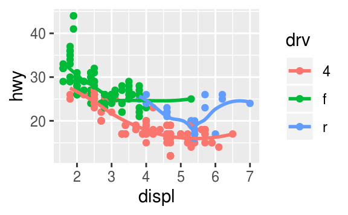
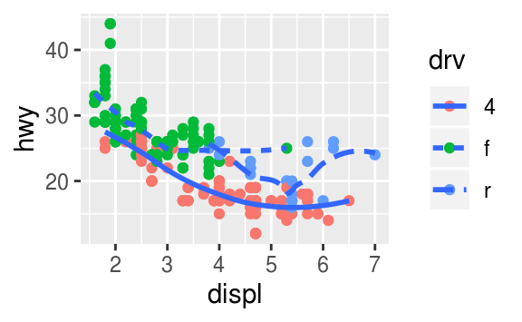

# Preamble

Most of this workshop is taken from Hadley's [R for Data Science](https://r4ds.had.co.nz/) book. You can find more examples, explanations and exercises there if you want.

## What this workshop covers and does not cover

In this workshop you'll learn principles behind exploratory data analysis and visualization, including tidying and transforming data to answer questions you might want to ask. What you will *not* learn is how to make specific plots.

## Exercises

There are exercises spread throughout this workshop. We're not going to cover them, but feel free to work on them if you feel like the lecture is going too slow for you. Solutions to a few are at the very end of this notebook.

## Some useful but not necessary notes

 * With Jupyter Notebook you can get a nice popup of function definitions just like you can in RStudio. Simply navigate to a cell or start a new one, and enter in `?function` like you would normally. A popup will appear.
 * You should see an `Insert` dropdown menu and `Run` button at the top which lets you add cells as well as run code or render Markdown in the cells, but these are very useful keyboard shortcuts for the same functions:
     * `Shift+Enter`: Run code or render Markdown in the current cell you're on
     * `Esc+a`: Add a cell above
     * `Esc+b`: Add a cell below
     * `Esc+dd`: Delete a cell

# Package prerequisites

Packages that required in this workshop are **tidyverse**, which includes the packages **ggplot2**, **dplyr**, **purrr**, and others, **gridExtra** which helps with arranging plots next to each other, **ggrepel** which helps with plot labels and **maps** which is for map data.


```{r packages}
library(tidyverse)
library(gridExtra)
library(ggrepel)
library(maps)
```

If you get an error message “there is no package called ‘xyz’” then you need to install the packages first. (They should have been preloaded on your notebooks but if not it's ok, it won't take long.)


```R
#install.packages('tidyverse')
#install.packages('gridExtra')
#install.packages('ggrepel')
#install.packages('map')
```

# Visualizing Data

Core feature of exploratory data analysis is asking questions about data and searching for answers by visualizing and modeling data. Most questions around what type of variation or covariation occurs between variables.


```{r regplot}
options(repr.plot.width=6, repr.plot.height=4)
# regular plot functions in R
plot(x=mpg$displ,y=mpg$hwy)
```

```{r ggplot}
# ggplot!
ggplot(data=mpg) + geom_point(mapping=aes(x=displ,y=hwy))
```


Basic syntax of ggplot:
```
ggplot(data=<DATA>) +
    <GEOM_FUNCTION>(mapping=aes(<MAPPINGS>)
```

```{r ggplotfancy}
ggplot(mpg, aes(displ, hwy)) +
  geom_point(aes(color = class)) +
  geom_smooth(se = FALSE) +
  labs(x="Engine displacement (L)",y="Heighway fuel economy (mpg)",
    title = "Fuel efficiency generally decreases with engine size",
    caption = "Data from fueleconomy.gov",
    subtitle = "Two seaters (sports cars) are an exception because of their light weight",
    colour = "Car type"
  ) + theme_classic()
```

## But first...

```
ggplot(data=<DATA>) +
    <GEOM_FUNCTION>(mapping=aes(<MAPPINGS>)
```

How do we get data into a form appropriate for **ggplot2**?

# Tidying Data

Most datasets are data frames made up of **rows** and **columns**. However, talking about data frames just in terms of what rows and columns it has is not enough.

 * **Variable:** quantity, quality, property that can be measured.
 * **Value:** State of variable when measured.
 * **Observation:** Set of measurements made under similar conditions
 * **Tabular data:** Set of values, each associated with a variable and an observation.


Tidy data:
 * Each variable is its own column
 * Each observation is its own row
 * Each value is in a single cell
 
Benefits:
 * Easy to manipulate
 * Easy to model
 * Easy to visualize
 * Has a specific and consistent structure
 * Stucture makes it easy to tidy other data
 
Cons:
 * Data frame is not as easy to look at

Consider the following tables:


```{r table1}
table1 <- data.frame(makemodel=c("audi a4","audi a4","chevrolet corvette","chevrolet corvette","honda civic","honda civic"),
                    year=rep(c(1999,2008),3),
                    cty=c(18,21,15,15,24,25),
                    hwy=c(29,30,23,25,32,36))
table1
```


This is tidy data, because each column is a variable, each observation is a row, and each value is in a single cell

Next we will look at some non-tidy data and operations from the **tidyr** package (part of **tidyverse**) to make the data tidy. Many of you might be more used to using operations from **reshape2** like melting and casting. It's a very useful package with more functionality including aggregating data, but syntax with **tidyr** commands is more simpler and intuitive for the purposes of tidying data.

## Gathering


```{r table2}
table2a <- data.frame(makemodel=c("audi a4","chevrolet corvette","honda civic"),`1999`=c(18,15,24),'2008'=c(21,15,25),check.names=FALSE)
table2b <- data.frame(makemodel=c("audi a4","chevrolet corvette","honda civic"),`1999`=c(29,23,32),'2008'=c(30,25,36),check.names=FALSE)
table2a
table2b
```

`table2a` column names `1999` and `2008` represent values of `year` variable. `table2b` is the same. Each row represents 2 observations, not 1. Need to gather columns into new pair of variables.

Parameters:
 * Set of columns that represent values, not variables.
 * `key`: name of variable whose values are currently column names.
 * `value`: name of variable whose values are currently spread out across multiple columns.

Experiments often report data in the format of `table4a` and `table4b`. One reason is for presentation purposes it's very easy to look at. Another is storage is efficient for completely crossed designs and can allow matrix operations.


```{r tidy2a}
tidy2a <- gather(table2a,`1999`,`2008`,key="year",value="cty")
tidy2a
```

```{r tidy2b}
tidy2b <- gather(table2b, `1999`, `2008`, key = "year", value = "hwy")
tidy2b
```

Merge tables using `left_join()` (many other types of [table joins](https://dplyr.tidyverse.org/reference/join.html) as well)


```{r leftjoin}
left_join(tidy2a,tidy2b)
```

## Spreading

```{r spred}
table3 <- data.frame(makemodel=c(rep("audi a4",4),rep("chevrolet corvette",4),rep("honda civic",4)),
                    year=rep(c(1999,1999,2008,2008),3),
                    type=rep(c("cty","hwy"),6),
                     mileage=c(18,29,21,30,15,23,15,25,24,32,25,36))
table3
```

`table3` has each observation in two rows. Need to spread observations across columns with appropriate variable names instead.

Parameters:
 * `key`: Column that contains variable names.
 * `value`: Column that contains values for each variable.


```{r spread}
spread(table3, key=type,value=mileage)
```


### Exercises

1. Consider the example below, where we spread and then gather observations from the same columns in `stocks`. Why are `gather()` and `spread()` not perfectly symmetrical? (Hint: look at the variable types and column names)


```{r stocks}
stocks <- tibble(
  year   = c(2015, 2015, 2016, 2016),
  half  = c(   1,    2,     1,    2),
  return = c(1.88, 0.59, 0.92, 0.17)
)

stocks

stocks %>% 
  spread(year, return) %>% 
  gather("year", "return", `2015`:`2016`)
```

2. Why does spreading this tibble fail? How could you fix it?

```
people <- tribble(
  ~name,             ~key,    ~value,
  #-----------------|--------|------
  "Phillip Woods",   "age",       45,
  "Phillip Woods",   "height",   186,
  "Phillip Woods",   "age",       50,
  "Jessica Cordero", "age",       37,
  "Jessica Cordero", "height",   156
)
```

## Separating

```{r table4}
table4 <- data.frame(makemodel=c("audi a4","audi a4","chevrolet corvette","chevrolet corvette","honda civic","honda civic"),
                     year=rep(c(1999,2008),3),
                    mileages=c('18/29','21/30','15/23','15/25','24/32','25/36'))
table4
```

`table4` has `mileages` column that actually contains two variables (`cty` and `hwy`). Need to separate into two columns.

Parameters:
 * column/variable that needs to be separated.
 * `into`: columns to split into
 * `sep`: separator value. Can be regexp or positions to split at. If not provided then splits at non-alphanumeric characters.


```{r sept4}
separate(table4, mileages, into = c("cty", "hwy"), sep="/")
```


```{r sepmake}
sep <- separate(table4, makemodel, into = c("make", "model"), sep = ' ')
sep
```

## Uniting

Now `sep` has `make` and `model` columns that can be combined into a single column. In other words, we want to unite them.

Parameters:
 * Name of united column/variable
 * Names of columns/variables to be united
 * `sep`: Separator value. Default is '_'


```{r unite}
unite(sep, new, make, model)
```


```{r unite2}
unite(sep, makemodel, make, model, sep=' ')
```

## Piping

**dplyr** from **tidyverse** contains the 'pipe' (`%>%`) which allows you to combine multiple operations, directly taking output from a funtion as input to the next. Can save time and memory as well as make code easier to read. Can think of it this way: `x %>% f(y)` becomes `f(x,y)`, and `x %>% f(y) %>% g(z)` becomes `g(f(x,y),z)`, etc.


```{r pipe}
unite(sep, makemodel, make, model, sep=' ') %>%
    separate(mileages, into=c("cty","hwy"))
```

### Exercises

1. What do the `extra` and `fill` arguments do in `separate()`? Experiment with the various options for the following two toy datasets.


```R
tibble(x = c("a,b,c", "d,e,f,g", "h,i,j")) %>% 
  separate(x, c("one", "two", "three"))

tibble(x = c("a,b,c", "d,e", "f,g,i")) %>% 
  separate(x, c("one", "two", "three"))
```

## Not all data should be tidy

Matrices, phylogenetic trees (although `ggtree` and `treeio` have tidy representations that help with annotating trees), etc.

# Transforming (Tidy) Data

Now we know how to get tidy data. At this point we can already start visualizing our data. However in many cases we will need to further transform our data to narrow down variables and observations we are really interested in or to create new variables that are functions of our existing variables and data. This is known as **transforming** data.

 * `filter()` to pick observations (rows) by their values
 * `arrange()` to reorder rows, default is by ascending value
 * `select()` to pick variables (columns) by their names
 * `mutate()` to create new variables with functions of existing variables
 * `summarise()` to collapes many values down to a single summary
 * `group_by()` to set up functions to operate on groups rather than the whole data set
 * `%>%` propagates the output from a function as input to another. eg: x %>% f(y) becomes f(x,y), and x %>% f(y) %>% g(z) becomes g(f(x,y),z).
 
All functions have similar structure:
 1. First argument is data frame
 2. Next arguments describe what to do with data frame using variable names
 3. Result is new data frame
 
Will be working with data frame **mpg** for rest of workshop which comes with the **tidyverse** library.


```{r head}
head(mpg)
```


## `filter()` rows/observations

As name suggests filters out rows. First argument is name of data frame, next arguments are expressions that filter the data frame.


```{r no2}
# filter out 2seater cars
no_2seaters <- filter(mpg, class != "2seater")
head(no_2seaters)
```

```{r filtmake}
# filter out audis, chevys, and hondas
mpg %>% filter(!manufacturer %in% c("audi","chevrolet","honda")) %>% head
```


## `arrange()` rows/observations

Changes order of rows. First argument is name of data frame, next arguments are column names (or more complicated expressions) to order by. Default column ordering is by ascending order, can use `desc()` to do descending order. Missing values get sorted at the end regardless of what column ordering is chosen.


```{r arrange}
# arrange/reorder mpg by class
arrange(mpg, class) %>% head
```

```{r 2seatarrange}
# arrange/reorder data frame with 2seaters filtered out by class
# 2seaters does not appear which is as it should be
arrange(no_2seaters, class) %>% head
```

What kinds of cars have the best highway and city gas mileage?

```{r arrhwycty}
# arrange mpg so that first hwy mileage is by descending order, then cty mileage is by descending order
arrange(mpg, desc(hwy), desc(cty)) %>% head
```

Example of missing data getting placed at bottom.


```{r missing}
df <- data.frame(x=c(5,2,NA,6))
df
```

```{r misarr}
# arrange df by ascending order, NA will be at bottom
arrange(df, x)
```

```{r misdesc}
# arrange df by descending order, NA will be at bottom
arrange(df, desc(x))
```


If you want to bring `NA` to the top, you can instead use `!is.na(x)` which evaluates as a boolean, so FALSE/TRUE. The df gets arranged by FALSE first, so NA goes to the top. However the rest of the values are unsorted since they will all return TRUE, although you can add more arguments to sort by the same column. This can be done for any other variable you want to use to rearrange with boolean expressions instead.


```{r misna}
# rest of the values are unsorted because they are all T for !is.na(x)
arrange(df,!is.na(x))
```

```{r arrna}
# can arrange by x again to get ascending order
arrange(df,!is.na(x),desc(x))
```


## `select()` columns/variables

Selects columns, which can be useful when you have hundreds or thousands of variables in order to narrow down to what variables you're actually interested in. First argument is name of data frame, subsequent arguments are columns to select. Can use `a:b` to select all columns between `a` and `b`, or use `-a` to select all columns *except* a.


```{r select}
# select manufacturer, model, year, cty, hwy
select(mpg, manufacturer, model, year, cty, hwy) %>% head
```


```{r selectall}
# select all columns model thru hwy
select(mpg, model:hwy) %>% head
head(mpg)
```


```{r selectexcpt}
# select all columns except cyl thru drv and class
select(mpg, -(cyl:drv), -class) %>% head
```


## `mutate()` to add new variables or `transmute()` to keep only new variables

Adds new columns that are functions of existing columns. First argument is name of data frame, next arguments are of the form `new_column_name = f(existing columns)`.


```{r mut}
# add a new column that takes average mileage between city and highway
mutate(mpg, avg_mileage = (cty+hwy)/2) %>% head
```


```{r transm}
# keep only average mileage between city and highway
transmute(mpg,cty,avg_mileage=(cty+hwy)/2) %>% head
```


## `summarise()` and `group_by()` for grouped summaries

`summarise()` collapses a data frame into a single row, and `group_by()` changes analysis from entire data frame into individual groups.


```{r sum}
# get average mileage grouped by engine cylinder
m <- mutate(mpg, avg_mileage=(cty+hwy)/2)
# behavior is actually different in R/RStudio compared to notebooks
m %>% group_by(cyl) %>%
    summarise(avg=mean(avg_mileage)) %>%
    head
```


**Note:** If you look at the output of `group_by` in R/RStudio you will actually be able to see what your groupings are as well as how many of them you have. For example if we did `group_by(mpg, cyl)` the output would include `cyl [4]` which shows that our grouping is by `cyl` and there are 4 groups. Jupyter notebook doesn't display this for reasons having to do with [how data frames are outputted](https://github.com/IRkernel/repr/issues/113). Some other differences exist between how certain objects from **tidyverse** are displayed as well.


```{r groupby}
group_by(m, drv) %>%
    summarise(avg=mean(avg_mileage))
```

```{r groupsumarr}
# df after group_by would show that we have 9 groups
drv_cyl <- group_by(m, drv, cyl) %>%
    summarise(avg=mean(avg_mileage)) %>%
    arrange(desc(avg))
drv_cyl
```


Can also run `ungroup` to ungroup your observations.


```{r sumax}
drv_cyl %>% summarise(max=max(avg))
```

```{r ungroup}
ungroup(drv_cyl) %>% summarise(max=max(avg))
```


### Exercises

1. Find all cars that:
    * Have an average gas mileage greater than 20mpg
    * Have an automatic transmission
    * Are 4-wheel drive
    
2. Earlier we computed the average mileage with an explicit formula by taking city mileage + highway mileage and dividing the sum by two. How can you do this without typing out the exact formula? What happens if there are `NA`s? Feel free to experiment on the dataframe `ex2_df` to arrive at an answer.
    
3. Find all cars grouped by manufacturer, model, cylinder, and auto/manual transmission that improved on gas mileage (either city, highway, or both, you choose) by at least 1mpg between 1999 and 2008. (This one might take some time, if you just look at city mileage you should end up with 26 rows in your data frame.)


```{r ex2df}
ex2_df <- data.frame(x=c(5,2,NA,6),y=c(NA,5,10,3))
```

# Back to Visualizing Data

Basic syntax of ggplot:
```
ggplot(data=<DATA>) +
    <GEOM_FUNCTION>(mapping=aes(<MAPPINGS>)
```


```{r mpgagain}
head(mpg) # automatically loaded when you load tidyverse
```


Let's break down the components of ggplot. First, note that `ggplot(data=<DATA>)` on its own will not actually plot anything.


```{r blankggplot}
ggplot(mpg)
```


This is because we need the `<GEOM_FUNCTION>(mapping=aes(<MAPPINGS>)` to tell us what exactly to plot using our data. However, just `ggplot(data=<DATA>) + <GEOM_FUNCTION>()` on its own doesn't do anything either.


```
ggplot(mpg) + geom_point()
```


So in fact we need *all* of the components described in the ggplot syntax.


```{r allparts}
ggplot(mpg) + geom_point(mapping=aes(x=displ,y=hwy))
```

## `<MAPPINGS>`

```
ggplot(data=<DATA>) +
    <GEOM_FUNCTION>(mapping=aes(<MAPPINGS>)
```

Visual property of objects in plot, i.e. size, shape, color. Can display points from other variables (in this case class) in different ways by changing value of aesthetic properties. These are known as **levels**, which is done in order to distinguish aesthetic values from data values.


```{r aes}
p1 <- ggplot(data=mpg) + geom_point(mapping=aes(x=displ,y=hwy,color=class))
p2 <- ggplot(data=mpg) + geom_point(mapping=aes(x=displ,y=hwy,shape=class))
p3 <- ggplot(data=mpg) + geom_point(mapping=aes(x=displ,y=hwy,size=class))
p4 <- ggplot(data=mpg) + geom_point(mapping=aes(x=displ,y=hwy,alpha=class))
grid.arrange(p1,p2,p3,p4,nrow=2)
```


### Exercises

1. Make a scatterplot of hwy vs cyl.

2. What does the `stroke` aesthetic do? What shapes does it work with? Use one of the pieces of code above to make the same plot but with `stroke=3` and a different fill. (Hint: use ?geom_point)

3. What happens if you map an aesthetic to something other than a variable name, like `aes(colour = displ < 5)`? Note, you’ll also need to specify x and y.

### Levels

**ggplot2** automatically assigns a unique level of an aesthetic to a unique value of the variable. This process is known as scaling. It will also automatically select a scale to use with the aesthetic (i.e. continuous or discrete) as well as add a legend explaining the mapping between levels and values. That's why in the size mapping there's no shape for suv, and why the following two pieces of code do different things:


```{r color1}
# for color property, all data points were assigned to 'blue', therefore ggplot2 assigns a single level to all of the
# points, which is red
ggplot(data=mpg) + geom_point(mapping=aes(x=displ,y=hwy,color='blue'))
```


```{r color2}
# here color is placed outside aesthetic mapping, so ggplot2 understands that we want color of points to be blue
ggplot(data=mpg) + geom_point(mapping=aes(x=displ,y=hwy),color='blue')
```


```{r color3}
# cty is a continuous variable, so when mapped to color we get a gradient with bins instead
ggplot(data=mpg) + geom_point(mapping=aes(x=displ,y=hwy,color=cty))
```


### Continuous vs discrete scales

Generally continuous scales get chosen for numerical data and discrete scales are chosen for categorical data. If your data is numeric but in discrete categories you may have to use `as.factor()` in order to get proper levels.


```
# if we try to map cyl to shape we get an error because shape is only for discrete variables
# even though we only have cyl=4,5,6 or 8
ggplot(data=mpg) + geom_point(mapping=aes(x=displ,y=hwy,shape=cyl))
```


```{r asfact}
# will transform into categorical variable with levels
as.factor(mpg$cyl)
```


```{r cont2}
# all is well when we use as.factor()
ggplot(data=mpg) + geom_point(mapping=aes(x=displ,y=hwy,shape=as.factor(cyl)))
```


Note that this means x and y are aesthetic mappings as well. In fact without them you will get an error.


```
ggplot(data=mpg) + geom_point()
```


## `<GEOM_FUNCTION>`

```
ggplot(data=<DATA>) +
    <GEOM_FUNCTION>(mapping=aes(<MAPPINGS>)
```

**geom** geometrical object plot uses to represent data. Bar charts use bar geoms, line charts use line geoms, boxplots, etc. Scatterplots use point geoms. Full list of geoms provided with **ggplot2** can be seen in [ggplot2 reference](https://ggplot2.tidyverse.org/reference/#section-layer-geoms). Also exist other geoms created by [other packages](http://www.ggplot2-exts.org/gallery/).

Every geom function in ggplot2 takes a `mapping` argument with specific aesthetic mappings that are possible. Not every aesthetic will work with every geom. For example, can set shape of a point, but not shape of a line. However, can set linetype of a line.


```{r smooth}
ggplot(data = mpg) +
  geom_smooth(mapping = aes(x = displ, y = hwy))
```

```{r smooth2}
# data has been separated into three lines based on their drivetrain: 4 (4wd), f (front), r (rear)
ggplot(data = mpg) +
  geom_smooth(mapping = aes(x = displ, y = hwy, linetype = as.factor(cyl)))
```

Can display multiple geoms on same plot just by adding them

```{r smooth3}
ggplot(data = mpg) + 
  geom_point(mapping = aes(x = displ, y = hwy, color=drv)) +
  geom_smooth(mapping = aes(x = displ, y = hwy, color=drv, linetype=drv))
```


Geoms like `geom_smooth()` use single geometric object to display multiple rows of data. If you don't necessarily want to add other distinguishing features to the geom like color, can use `group` aesthetic (for a categorical variable) to draw multiple objects.


```{r smooth4}
ggplot(data=mpg) +
    geom_smooth(mapping=aes(x=displ,y=hwy,group=drv))
```


### Global mappings vs local mappings

`ggplot()` function contains *global* mapping, while each geom has a local mapping

 * `lm` from **stats** for linear models (you can also fit other models)


```{r glob1}
# global mapping of displ and hwy creates x and yaxis
ggplot(data=mpg, mapping=aes(x=displ,y=hwy))
```

```{r glob2}
# mapping color to class for point geom while using global x and y mappings
ggplot(data=mpg, mapping=aes(x=displ,y=hwy)) + geom_point(mapping=aes(color=class))
```

```{r glob3}
# geom_smooth doesn't need any mapping arguments if using global
ggplot(data=mpg, mapping=aes(x=displ,y=hwy)) +
    geom_point(mapping=aes(color=class))+
    geom_smooth()
```


```{r glob4}
# second geom_smooth uses same x and y mapping
# but mapping comes from no_2seaters data (from Transform section) instead
ggplot(data = mpg, mapping = aes(x = displ, y = hwy)) + 
  geom_point(mapping = aes(color = class)) + 
  geom_smooth() +
  geom_smooth(data = no_2seaters)
```

### Exercise

4. Recreate the R code necessary to generate the following graphs.

<table><tr><td></td><td></td></tr>
<tr><td></td><td></td></tr>
<tr><td></td><td></td></tr></table>

## More syntax

```
ggplot(data = <DATA>) + 
  <GEOM_FUNCTION>(
     mapping = aes(<MAPPINGS>),
     stat = <STAT>, 
     position = <POSITION>
  ) +
  <COORDINATE_FUNCTION> +
  <FACET_FUNCTION>
```

## Facets

Subplots displaying one subset of data.

 * `facet_wrap()` for a single variable.
 * `facet_grid()` for along 2 variables.


```{r facet1}
ggplot(data=mpg) +
    geom_point(mapping=aes(x=displ,y=hwy)) +
    facet_wrap(~ class, nrow=2)
```


```{r facet2}
ggplot(data=mpg) +
    geom_point(mapping=aes(x=displ,y=hwy)) +
    facet_wrap(~ class, nrow=3)
```


```{r facet3}
ggplot(data=mpg) +
    geom_point(mapping=aes(x=displ,y=hwy)) +
    facet_wrap(~ class, ncol=4)
```

```{r facet4}
# some facets are empty because no observations have those combos
ggplot(data = mpg) + 
  geom_point(mapping = aes(x = displ, y = hwy)) + 
  facet_grid(drv ~ cyl)
```

## Stats

```
ggplot(data = <DATA>) + 
  <GEOM_FUNCTION>(
     mapping = aes(<MAPPINGS>),
     stat = <STAT>, 
     position = <POSITION>
  ) +
  <COORDINATE_FUNCTION> +
  <FACET_FUNCTION>
```

Algorithm used to calculate new values for a graph. Each geom object has a default stat, and each stat has a default geom. Geoms like `geom_point()` will leave data as is, known as `stat_identity()`. Graphs like bar charts and histograms will bin your data and compute bin counts, known as `stat_count()`. Can see full list of stats at [ggplot2 reference](https://ggplot2.tidyverse.org/reference/) under both Layer: geoms and Layer: stats.


```{r stat1}
ggplot(data=mpg) +
    geom_bar(mapping=aes(x=class))
```

Since each stat comes with a default geom, can use stat to create geoms on plots as well.


```{r stat2}
ggplot(data=mpg) +
    stat_count(mapping=aes(x=class))
?geom_bar
```


```{r stat3}
# because stat_count() computes count and prop, can use those as variables for mapping as well
ggplot(data=mpg) + geom_bar(mapping=aes(x=class, y=..prop..,group=1))
```


```{r stat4}
# stat_summary is associated with geom_pointrange
# default is to compute mean and standard error
ggplot(data = mpg) + 
  stat_summary(mapping = aes(x=class,y=hwy))
```


```{r stat5}
# can change stat_summary to compute median and min/max instead
ggplot(data = mpg) +
  stat_summary(
    mapping = aes(x = class, y = hwy),
    fun.ymin = min,
    fun.ymax = max,
    fun.y = median
  )
```

## Position adjustments

```
ggplot(data = <DATA>) + 
  <GEOM_FUNCTION>(
     mapping = aes(<MAPPINGS>),
     stat = <STAT>, 
     position = <POSITION>
  ) +
  <COORDINATE_FUNCTION> +
  <FACET_FUNCTION>
```

Each geom also comes with a default **position adjustment** specified by `position` argument. For geoms like `geom_point()` it is "identity" which is position as is.

Specifically for bar charts, have fill aesthetic. If fill aesthetic gets mapped to another variable, bars are automatically stacked under the "stack" position. Can see [list of positions](https://ggplot2.tidyverse.org/reference/#section-layer-position-adjustment) at ggplot2 reference.


```{r pos1}
p1 <- ggplot(data = mpg, mapping=aes(x=class,fill=as.factor(cyl)))
p1 + geom_bar()
```

```{r pos2}
# position = identity will place each object exactly where it falls in context of graph.
# Not useful for bar charts, better for scatterplots.
p1 + geom_bar(position="identity", alpha=0.2)
```

```{r pos3}
# position = fill will make bars same height
p1 + geom_bar(position="fill")
```


```{r pos4}
# position = "dodge" places objects directly beside one another. Easier to compare individual values.
p1 + geom_bar(position="dodge")
```


For `geom_point` one possible position is "jitter", which will add a small amount of random noise to each point. This spreads points out so that it's unlikely for points to overlap and therefore get plotted over each other. For example it's possible that majority of points are actually one combination of `hwy` and `displ` but they all get plotted at the exact same point so you can't tell. For very large datasets can help prevent overplotting to better see where mass of plot is or trends.


```{r pos5}
# seems quite uniform which suggests multiple observations with same value of cty/hwy
# creating overlapping points
ggplot(data = mpg, mapping = aes(x = cty, y = hwy)) + 
  geom_point()
```


```{r pos6}
# definitely the case
ggplot(data = mpg, mapping = aes(x = cty, y = hwy)) + 
  geom_point(position="jitter")
```


## Coordinate systems

```
ggplot(data = <DATA>) + 
  <GEOM_FUNCTION>(
     mapping = aes(<MAPPINGS>),
     stat = <STAT>, 
     position = <POSITION>
  ) +
  <COORDINATE_FUNCTION> +
  <FACET_FUNCTION>
```

Default coordinate system is Cartesian.

 * `coord_flip()` switches x and y axes.
 * `coord_quickmap()` sets aspect ratio for maps.
 * `coord_polar()` sets polar coordinates.


```{r coord1}
p <- ggplot(data = mpg, mapping = aes(x = class, y = hwy))
p + geom_boxplot()
```


```{r corrd2}
# flipping coordinates
p + geom_boxplot() + coord_flip()
```


```{r coord3}
# can reorder x axis by lowest to highest median hwy mileage
# allows easier comparisons
ggplot(data = mpg, mapping = aes(x = reorder(class,hwy,FUN=median), y = hwy)) + 
  geom_boxplot() +
  coord_flip()
```


```{r map1}
# Setting aspect ratio correctly
nz <- map_data("nz")

ggplot(nz, aes(long, lat, group = group)) +
  geom_polygon(fill = "white", colour = "black")

ggplot(nz, aes(long, lat, group = group)) +
  geom_polygon(fill = "white", colour = "black") +
  coord_quickmap()
```


```{r pol1}
# polar coordinates
bar <- ggplot(data = mpg) + 
  geom_bar(
    mapping = aes(x = class, fill = as.factor(cyl)), 
    show.legend = FALSE,
    width = 1
  ) + 
  theme(aspect.ratio = 1) +
  labs(x = NULL, y = NULL)

p1 <- bar + coord_flip()
p2 <- bar + coord_polar()
grid.arrange(p1,p2, nrow=1)
```

# Summary

Now that we've gone through tidying, transforming, and visualizing data let's review all of the different functions we've used and in some cases learned the inner workings of:

## Tidying

 * `gather()`
 * `spread()`
 * `separate()`
 * `unite()`
 * `%>%` propagates the output from a function as input to another. eg: x %>% f(y) becomes f(x,y), and x %>% f(y) %>% g(z) becomes g(f(x,y),z).
 
## Transforming

 * `filter()` to pick observations (rows) by their values
 * `arrange()` to reorder rows, default is by ascending value
 * `select()` to pick variables (columns) by their names
 * `mutate()` to create new variables with functions of existing variables
 * `summarise()` to collapes many values down to a single summary
 * `group_by()` to set up functions to operate on groups rather than the whole data set
 
## Visualizing

 * `ggplot` - global data and mappings
 * `geom_point` - geom for scatterplots
 * `geom_smooth` - geom for regressions
 * `geom_pointrange` - geom for vertical intervals defined by `x`, `y`, `ymin`, and `ymax`
 * `geom_bar` - geom for barcharts
 * `geom_boxplot` - geom for boxplots
 * `geom_polygon` - geom for polygons
 * `aes(color)` - color mapping
 * `aes(shape)` - shape mapping
 * `aes(size)` - size mapping
 * `aes(alpha)` - transparency mapping
 * `as.factor()` - transforming numerical values to categorical values with levels
 * `facet_grid`
 * `facet_wrap`
 * `stat_count` - default stat for barcharts, bins by x and counts
 * `stat_identity` - default stat for scatterplots, leaves data as is
 * `stat_summary` - default stat for pointrange, by default computes mean and se of y by x
 * `position="identity"`
 * `position="stacked"`
 * `position="fill"`
 * `position="dodge"`
 * `position="jitter"`
 * `coord_flip`
 * `coord_map`
 * `coord_polar`

# Publication Quality Graphs

Last piece with some additional functions to learn...

## Labels

`labs()` to add most kinds of labels: title, subtitle, captions, x-axis, y-axis, legend, etc.


```{r lab1}
ggplot(mpg, aes(displ, hwy)) +
  geom_point(aes(color = class)) +
  geom_smooth(se = FALSE) +
  labs(
    title = "Fuel efficiency generally\n decreases with engine size",
    subtitle = "Two seaters (sports cars) are an exception because of their light weight",
    caption = "Data from fueleconomy.gov",
    x = "Engine displacement (L)",
    y = "Highway fuel economy (mpg)",
    color = "Car type"
  )
```


## Annotations

Can use `geom_text()` to add text labesls on the plot.


```{r lab2}
best_in_class <- mpg %>%
  group_by(class) %>%
  filter(row_number(desc(hwy)) == 1)

ggplot(mpg, aes(displ, hwy)) +
  geom_point(aes(colour = class)) +
  geom_text(aes(label = model), data = best_in_class)
```

```{r lab3}
ggplot(mpg, aes(displ, hwy)) +
  geom_point(aes(colour = class)) +
  ggrepel::geom_label_repel(aes(label = model), data = best_in_class) +
  labs(
    caption = "Data from fueleconomy.gov",
    x = "Engine displacement (L)",
    y = "Highway fuel economy (mpg)",
    colour = "Car type"
  ) +
  geom_point(size = 3, shape = 1, data = best_in_class)
```


## Scales

 * `breaks`: For the position of ticks
 * `labels`: For the text label associated with each tick.
 * Default scale is x continuous, y continuous but can also do x logarithmic, y logarithmic, change color scales.


```{r scale1}
ggplot(mpg, aes(displ, hwy)) +
  geom_point() +
  scale_y_continuous(breaks = seq(15, 40, by = 5))
```

```{r scale2}
ggplot(mpg, aes(displ, hwy)) +
  geom_point() +
  scale_x_continuous(labels = NULL) +
  scale_y_continuous(labels = NULL)
```


```{r scale3}
p1 <- ggplot(diamonds, aes(carat, price)) +
  geom_bin2d()
ggplot(diamonds, aes(carat, price)) +
  geom_bin2d() + 
  scale_x_log10() + 
  scale_y_log10()

ggplot(diamonds, aes(log10(carat), log10(price))) +
  geom_bin2d()
```


```{r scale4}
ggplot(mpg, aes(displ, hwy)) +
  geom_point(aes(color = drv))

ggplot(mpg, aes(displ, hwy)) +
  geom_point(aes(color = drv)) +
  scale_colour_brewer(palette = "Set1")
```


```{r scale5}
ggplot(mpg, aes(displ, hwy)) +
  geom_point(aes(color = drv)) +
  scale_colour_manual(values=c(`4`="red",f="blue",r="blue"))
```


## Legend positioning

`theme(legend.position)` to control legend position. `guides()` with `guide_legened()` or `guide_colourbar()` for legend display.


```{r leg1}
base <- ggplot(mpg, aes(displ, hwy)) +
  geom_point(aes(colour = class))

#p1 <- base + theme(legend.position = "left")
#p2 <- base + theme(legend.position = "top")
#p3 <- base + theme(legend.position = "bottom")
#p4 <- base + theme(legend.position = "right")

#?theme
base + theme(text=element_text(color="blue",size=4))

#grid.arrange(p1,p2,p3,p4, nrow=2)
```

```{r leg2}
ggplot(mpg, aes(displ, hwy)) +
  geom_point(aes(colour = class)) +
  geom_smooth(se = FALSE) +
  theme(legend.position = "bottom") +
  guides(colour = guide_legend(nrow = 1, override.aes = list(size = 4)))
```


## Zooming

Three ways to control plot limits:
 * Adjusting what data are plotted
 * Setting limits in each scale
 * Setting `xlim` and `ylim` in `coord_cartesian()`


```{r zoom1}
# asetting xlim and ylim in coord_cartesian
ggplot(mpg, mapping = aes(displ, hwy)) +
  geom_point(aes(color = class)) +
  geom_smooth() +
  coord_cartesian(xlim = c(5, 7), ylim = c(10, 30))
```


```{r zoom2}
# adjusting what data are plotted
# however geom_smooth will plot regression over subsetted data
filter(mpg, displ >= 5, displ <= 7, hwy >= 10, hwy <= 30) %>%
  ggplot(aes(displ, hwy)) +
  geom_point(aes(color = class)) +
  geom_smooth()
```


```{r zoom3}
# 2 plots use subsetted data therefore have different scales along hwy and displ
suv <- mpg %>% filter(class == "suv")
compact <- mpg %>% filter(class == "compact")
ggplot(suv, aes(displ, hwy, colour = drv)) +
  geom_point()

ggplot(compact, aes(displ, hwy, colour = drv)) +
  geom_point()
```

```{r zoom4}
# can set limits in each scale
x_scale <- scale_x_continuous(limits = range(mpg$displ))
y_scale <- scale_y_continuous(limits = range(mpg$hwy))
col_scale <- scale_colour_discrete(limits = unique(mpg$drv))

ggplot(suv, aes(displ, hwy, colour = drv)) +
  geom_point() +
  x_scale +
  y_scale +
  col_scale

ggplot(compact, aes(displ, hwy, colour = drv)) +
  geom_point() +
  x_scale +
  y_scale +
  col_scale
```


## Themes

**ggplot2** has 8 themes by default, can get more in other packages like **ggthemes**. Generally prefer `theme_classic()`.


```{r theme1}
base <- ggplot(mpg, aes(displ, hwy)) +
  geom_point(aes(color = class)) +
  geom_smooth(se = FALSE)

p1 <- base + theme_bw()
p2 <- base + theme_light()
p3 <- base + theme_classic()
p4 <- base + theme_linedraw()
p5 <- base + theme_dark()
p6 <- base + theme_minimal()
p7 <- base + theme_void()

grid.arrange(base,p1,p2,p3,p4,p5,p6,p7,nrow=4)
```


## Saving your plots

 * `ggsave()` will save most recent plot to disk
 * `tiff()` will save next plot to disk
 * Other functions like `postscript()` for eps files, etc.
 * All can take `width`, `height`, `fonts`, `pointsize`, `res` (resolution) arguments


```{r save1}
p1 <- ggplot(mpg, aes(displ, hwy)) +
  geom_point(aes(color = class)) +
  geom_smooth(se = FALSE) +
  labs(x="Engine displacement (L)",y="Heighway fuel economy (mpg)",
    title = "Fuel efficiency generally decreases with engine size",
    caption = "Data from fueleconomy.gov",
    subtitle = "Two seaters (sports cars) are an exception because of their light weight",
    colour = "Car type"
  ) + x_scale + y_scale + theme_classic()
p1
ggsave("my_plot.pdf")

tiff("my_plot.tiff",width=7,height=5,units="in",pointsize=8,res=350)
p1
dev.off()
```


# Some other useful visualization packages

We don't have time in this workshop to get in depth to other workshops, but here are some more useful visualization packages that may be helpful for your research.

## ggtree for phylogenetics

Resources and associated packages:
 * [Data Integration, Manipulation and Visualization of Phylogenetic Trees](https://yulab-smu.github.io/treedata-book/index.html)
 * [treeio](https://bioconductor.org/packages/release/bioc/html/treeio.html)
 * [tidytree](https://cran.r-project.org/web/packages/tidytree/index.html)
 
## cowplot

Meant to provide publication-ready theme for **gplot2** that requires minimum amount of fiddling with sizes of axis labels, plot backgrounds, etc. Auto-sets `theme_classic()` for all plots.

## Gviz for plotting data along genomic coordinates

Can be installed from [Bioconductor](https://bioconductor.org/packages/release/bioc/html/Gviz.html).

## phyloseq for metagenomics

Website is [very comprehensive](http://joey711.github.io/phyloseq/).

## Some exercise solutions

### Transforming Data

2. Earlier we computed the average mileage with an explicit formula by taking city mileage + highway mileage and dividing the sum by two. How can you do this without typing out the exact formula? What happens if there are `NA`s? Feel free to experiment on the dataframe `ex2_df` to arrive at an answer.


```{r sol1}
rowMeans(ex2_df)
rowMeans(ex2_df,na.rm=TRUE)
mutate(mpg, avg_mileage = rowMeans(select(mpg,cty,hwy),na.rm=TRUE)) %>%
    head
```

3. Find all cars grouped by manufacturer, model, cylinder, and auto/manual transmission that improved on gas mileage (either city, highway, or both, you choose) by at least 1mpg between 1999 and 2008. (This one might take some time, if you just look at city mileage you should end up with 26 rows in your data frame.)


```{r sol2}
separate(mpg,trans,into=c('trans',NA),sep='\\(') %>%
    group_by(manufacturer, model, cyl,trans) %>%
    mutate(imp=cty-mean(cty)) %>%
    filter(year==2008,imp>1)
```


### Visualizing Data

1. Make a scatterplot of hwy vs cyl


```{r sol3}
ggplot(mpg) + geom_point(aes(x=cyl,y=hwy))
```


```{r sesinf}
sessionInfo()
```